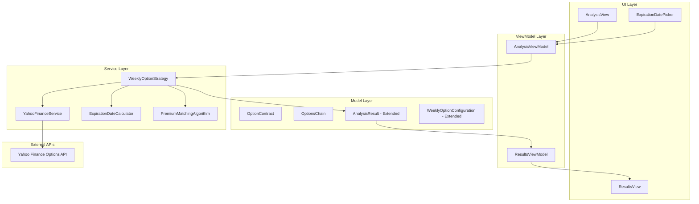
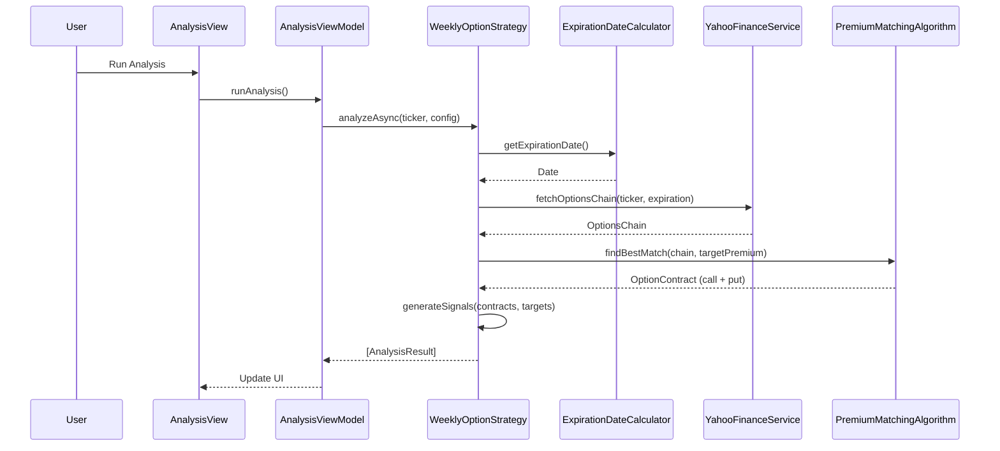
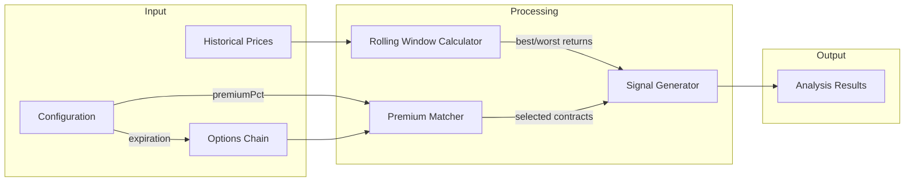
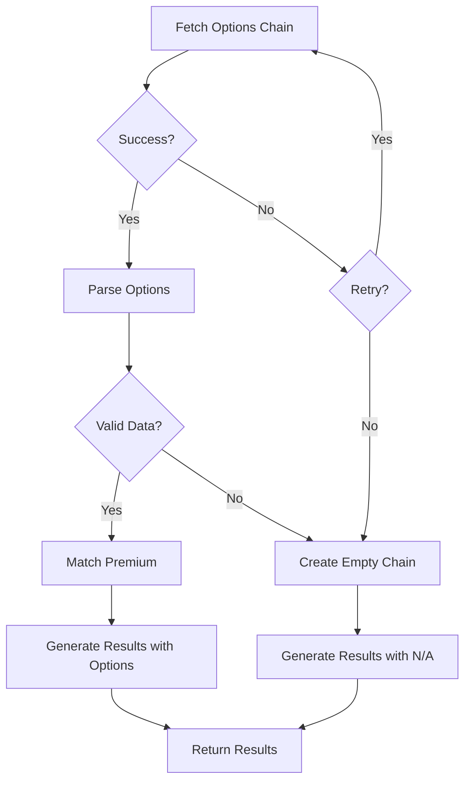

# Design Document: Live Options Chain Integration

## Overview

This design document describes the technical architecture for integrating live options chain data into the TradingGuru Weekly Option Strategy. The feature extends the existing `YahooFinanceService` to fetch real-time options data, enabling the strategy to identify specific option contracts with strike prices and premiums that meet user trading criteria.

The implementation follows the existing MVVM architecture and protocol-oriented design patterns, ensuring seamless integration with current components while adding new capabilities for options chain fetching, expiration date calculation, premium matching, and enhanced signal generation.

### Key Design Goals

1. **Minimal Disruption**: Extend existing services and models rather than replacing them
2. **Protocol Conformance**: Use existing protocols where possible, extend with new protocols as needed
3. **Session-scoped State**: Expiration override resets on app restart (not persisted)
4. **Graceful Degradation**: Handle missing options data without breaking existing analysis flow

## Architecture

### High-Level System Architecture




### Component Interaction Flow



### Data Flow Diagram



## Components and Interfaces

### New Protocol: OptionsDataService

Extends `MarketDataService` to add options chain fetching capabilities.

```swift
/// Protocol extension for options chain data fetching.
/// - Validates: Requirement 1.1, 1.2, 1.3 (Options chain data fetching)
protocol OptionsDataService: MarketDataService {
    /// Fetches the options chain for a ticker and expiration date.
    /// - Parameters:
    ///   - ticker: The stock ticker symbol
    ///   - expirationDate: The target expiration date
    /// - Returns: OptionsChain containing calls and puts
    /// - Throws: OptionsDataError if fetch fails
    func fetchOptionsChain(
        ticker: String,
        expirationDate: Date
    ) async throws -> OptionsChain
}
```


### New Protocol: ExpirationDateCalculation

Handles weekly expiration date logic with holiday awareness.

```swift
/// Protocol for calculating options expiration dates.
/// - Validates: Requirement 2 (Default expiration date calculation)
protocol ExpirationDateCalculation {
    /// Calculates the default weekly expiration date.
    /// - Parameter referenceDate: The date to calculate from (defaults to today)
    /// - Returns: The next valid expiration date
    func calculateDefaultExpiration(from referenceDate: Date) -> Date
    
    /// Validates if a date is a valid expiration date.
    /// - Parameter date: The date to validate
    /// - Returns: true if the date is a valid trading day
    func isValidExpirationDate(_ date: Date) -> Bool
    
    /// Checks if a date is a US market holiday.
    /// - Parameter date: The date to check
    /// - Returns: true if the date is a market holiday
    func isMarketHoliday(_ date: Date) -> Bool
}
```

### New Protocol: PremiumMatching

Algorithm for finding options closest to target premium.

```swift
/// Protocol for matching options to target premium.
/// - Validates: Requirement 4 (Target premium matching)
protocol PremiumMatching {
    /// Finds the call option closest to target premium.
    /// - Parameters:
    ///   - options: Array of call options
    ///   - targetPremium: The target premium amount
    /// - Returns: The best matching option, or nil if none available
    func findBestCallMatch(
        from options: [OptionContract],
        targetPremium: Double
    ) -> OptionContract?
    
    /// Finds the put option closest to target premium.
    /// - Parameters:
    ///   - options: Array of put options
    ///   - targetPremium: The target premium amount
    /// - Returns: The best matching option, or nil if none available
    func findBestPutMatch(
        from options: [OptionContract],
        targetPremium: Double
    ) -> OptionContract?
}
```

## Data Models

### OptionContract

Represents a single option contract from the options chain.

```swift
/// Represents a single option contract with pricing data.
/// - Validates: Requirement 1.3, 1.6 (Option contract data)
struct OptionContract: Codable, Identifiable, Equatable {
    /// Unique identifier for the contract
    let id: UUID
    
    /// The underlying stock ticker
    let ticker: String
    
    /// Option type (CALL or PUT)
    let type: OpportunityType
    
    /// The strike price
    let strikePrice: Double
    
    /// The bid price
    let bid: Double
    
    /// The ask price
    let ask: Double
    
    /// The expiration date
    let expirationDate: Date
    
    /// Calculated mid-price: (bid + ask) / 2
    /// - Validates: Requirement 1.6 (Mid-price calculation)
    var midPrice: Double {
        (bid + ask) / 2.0
    }
}
```


### OptionsChain

Container for all options at a given expiration.

```swift
/// Contains all option contracts for a ticker at a specific expiration.
/// - Validates: Requirement 1.2 (Retrieve calls and puts at all strikes)
struct OptionsChain: Codable, Equatable {
    /// The underlying stock ticker
    let ticker: String
    
    /// The expiration date for this chain
    let expirationDate: Date
    
    /// All call options in the chain
    let calls: [OptionContract]
    
    /// All put options in the chain
    let puts: [OptionContract]
    
    /// Timestamp when the chain was fetched
    let fetchedAt: Date
    
    /// Whether the chain is empty (no contracts)
    var isEmpty: Bool {
        calls.isEmpty && puts.isEmpty
    }
    
    /// Creates an empty chain for error cases.
    /// - Validates: Requirement 1.5 (Empty chain handling)
    static func empty(ticker: String, expirationDate: Date) -> OptionsChain {
        OptionsChain(
            ticker: ticker,
            expirationDate: expirationDate,
            calls: [],
            puts: [],
            fetchedAt: Date()
        )
    }
}
```

### Extended AnalysisResult

Add new fields for expiration, strike price and option premiums.

```swift
/// Extended analysis result including options data.
/// - Validates: Requirement 6 (Enhanced results display)
struct AnalysisResult: Codable, Identifiable, Equatable {
    // Existing fields
    let id: UUID
    let ticker: String
    let type: OpportunityType
    let returnPercentage: Double
    let currentPrice: Double
    let targetPrice: Double
    let signal: Signal
    let nextEarningsDate: Date?
    let hasEarningsRisk: Bool
    let analyzedAt: Date
    
    // NEW: Options-specific fields
    /// The expiration date of the selected option
    /// - Validates: Requirement 6.1 (Expiration Date column)
    let expirationDate: Date?
    
    /// The strike price of the selected option contract
    /// - Validates: Requirement 6.2 (Strike Price column)
    let strikePrice: Double?
    
    /// The bid price of the selected option
    /// - Validates: Requirement 6.3 (Bid Premium column)
    let bidPremium: Double?
    
    /// The ask price of the selected option
    /// - Validates: Requirement 6.4 (Ask Premium column)
    let askPremium: Double?
    
    /// The mid-price premium: (bid + ask) / 2
    /// - Validates: Requirement 6.5 (Mid Premium column)
    let midPremium: Double?
    
    /// The selected option contract (for reference)
    let selectedOption: OptionContract?
}
```


### Extended WeeklyOptionConfiguration

Add session-scoped expiration date override.

```swift
/// Extended configuration with expiration date override.
/// - Validates: Requirement 3 (User expiration date override)
struct WeeklyOptionConfiguration: Codable, Equatable {
    // Existing fields
    var windowDays: Int
    var lookbackDays: Int
    var premiumPct: Double
    var onlyOrders: Bool
    
    // NEW: Session-scoped override (not persisted via Codable)
    /// User-selected expiration date override (session-scoped, not persisted)
    /// - Validates: Requirement 3.4 (Reset on app restart)
    var expirationOverride: Date?
    
    /// Returns the effective expiration date to use.
    func effectiveExpirationDate(
        using calculator: ExpirationDateCalculation
    ) -> Date {
        expirationOverride ?? calculator.calculateDefaultExpiration(from: Date())
    }
    
    // Custom Codable to exclude expirationOverride from persistence
    enum CodingKeys: String, CodingKey {
        case windowDays, lookbackDays, premiumPct, onlyOrders
    }
}
```

### Extended AnalysisResultRow

Add display fields for new columns.

```swift
/// Extended result row with options display fields.
/// - Validates: Requirement 6 (New column display)
struct AnalysisResultRow: Identifiable, Equatable {
    // Existing fields
    let id: UUID
    let ticker: String
    let type: String
    let returnPercentage: String
    let currentPrice: String
    let targetPrice: String
    let signal: String
    let nextEarningsDate: String
    let isHighlighted: Bool
    let hasEarningsRisk: Bool
    let rawReturnPercentage: Double
    let rawCurrentPrice: Double
    let rawTargetPrice: Double
    let rawNextEarningsDate: Date?
    
    // NEW: Options display fields
    /// Expiration date formatted as YYYY-MM-DD or "N/A"
    let expirationDate: String
    
    /// Strike price formatted as currency or "N/A"
    let strikePrice: String
    
    /// Bid premium formatted as currency or "N/A"
    let bidPremium: String
    
    /// Ask premium formatted as currency or "N/A"
    let askPremium: String
    
    /// Mid premium formatted as currency or "N/A"
    let midPremium: String
    
    /// Raw values for sorting
    let rawExpirationDate: Date?
    let rawStrikePrice: Double?
    let rawMidPremium: Double?
}
```


### OptionsDataError

Error types for options chain operations.

```swift
/// Errors specific to options data operations.
/// - Validates: Requirement 1.4 (Error handling for options data)
enum OptionsDataError: Error, Equatable {
    /// Options data unavailable for ticker
    case optionsUnavailable(ticker: String)
    
    /// No options exist for the specified expiration
    case noOptionsForExpiration(ticker: String, expiration: Date)
    
    /// Invalid or malformed options data
    case invalidOptionsData(ticker: String)
    
    /// Network error during options fetch
    case networkError(underlying: String)
    
    /// Invalid expiration date selected
    /// - Validates: Requirement 3.7 (Invalid date validation)
    case invalidExpirationDate(date: Date, reason: String)
}
```

### Extended ResultColumn Enum

Add new sortable columns.

```swift
/// Extended columns for sorting.
/// - Validates: Requirements 6.8, 6.9 (Sort by new columns)
enum ResultColumn: String, CaseIterable {
    // Existing columns
    case ticker
    case type
    case returnPercentage
    case currentPrice
    case targetPrice
    case signal
    case nextEarningsDate
    
    // NEW: Options columns
    case expirationDate
    case strikePrice
    case bidPremium
    case askPremium
    case midPremium
}
```

## Service Implementations

### YahooFinanceService Extension

Extend the existing service to implement `OptionsDataService`.

```swift
extension YahooFinanceService: OptionsDataService {
    
    /// Base URL for Yahoo Finance options API
    private var optionsBaseURL: String {
        "https://query1.finance.yahoo.com/v7/finance/options/"
    }
    
    /// Fetches options chain data from Yahoo Finance.
    /// - Validates: Requirement 1.1 (Fetch options chain for ticker and expiration)
    func fetchOptionsChain(
        ticker: String,
        expirationDate: Date
    ) async throws -> OptionsChain {
        guard isValidTicker(ticker) else {
            throw OptionsDataError.optionsUnavailable(ticker: ticker)
        }
        
        let timestamp = Int(expirationDate.timeIntervalSince1970)
        guard let url = buildOptionsURL(ticker: ticker, expiration: timestamp) else {
            throw OptionsDataError.optionsUnavailable(ticker: ticker)
        }
        
        do {
            let (data, response) = try await session.data(from: url)
            
            guard let httpResponse = response as? HTTPURLResponse,
                  (200...299).contains(httpResponse.statusCode) else {
                throw OptionsDataError.optionsUnavailable(ticker: ticker)
            }
            
            return try parseOptionsResponse(
                data: data,
                ticker: ticker,
                expiration: expirationDate
            )
        } catch let error as OptionsDataError {
            throw error
        } catch {
            throw OptionsDataError.networkError(underlying: error.localizedDescription)
        }
    }
    
    private func buildOptionsURL(ticker: String, expiration: Int) -> URL? {
        var components = URLComponents(string: "\(optionsBaseURL)\(ticker)")
        components?.queryItems = [
            URLQueryItem(name: "date", value: String(expiration))
        ]
        return components?.url
    }
}
```


### ExpirationDateCalculator Implementation

```swift
/// Calculates weekly option expiration dates with holiday awareness.
/// - Validates: Requirement 2 (Default expiration date calculation)
final class ExpirationDateCalculator: ExpirationDateCalculation {
    
    private let calendar: Calendar
    
    init(calendar: Calendar = .current) {
        self.calendar = calendar
    }
    
    /// Calculates the default weekly expiration date.
    /// - Validates: Requirement 2.1, 2.2, 2.6
    func calculateDefaultExpiration(from referenceDate: Date) -> Date {
        var targetDate = nextFriday(from: referenceDate)
        
        // If Friday is a holiday, use Thursday
        if isMarketHoliday(targetDate) {
            targetDate = calendar.date(byAdding: .day, value: -1, to: targetDate)!
        }
        
        return targetDate
    }
    
    /// Finds the next Friday from the reference date.
    /// - Validates: Requirement 2.6 (Skip to following week if Saturday/Sunday)
    private func nextFriday(from date: Date) -> Date {
        let weekday = calendar.component(.weekday, from: date)
        
        // Calculate days until next Friday (Friday = 6)
        var daysToAdd: Int
        switch weekday {
        case 1: daysToAdd = 5  // Sunday
        case 2: daysToAdd = 4  // Monday
        case 3: daysToAdd = 3  // Tuesday
        case 4: daysToAdd = 2  // Wednesday
        case 5: daysToAdd = 1  // Thursday
        case 6: daysToAdd = 0  // Friday
        case 7: daysToAdd = 6  // Saturday - skip to next Friday
        default: daysToAdd = 0
        }
        
        // If Friday but after market close, move to next Friday
        if weekday == 6 {
            let hour = calendar.component(.hour, from: date)
            if hour >= 16 { daysToAdd = 7 }
        }
        
        return calendar.date(byAdding: .day, value: daysToAdd, to: date)!
    }
    
    /// Checks if a date is a US market holiday.
    /// - Validates: Requirement 2.3, 2.4, 2.5
    func isMarketHoliday(_ date: Date) -> Bool {
        let month = calendar.component(.month, from: date)
        let day = calendar.component(.day, from: date)
        let weekday = calendar.component(.weekday, from: date)
        let year = calendar.component(.year, from: date)
        
        // Only check Fridays
        guard weekday == 6 else { return false }
        
        // New Year's Day on Friday, or Dec 31 if Jan 1 is Saturday
        if (month == 1 && day == 1) || (month == 12 && day == 31 && isNextDaySaturday(date)) {
            return true
        }
        
        // Good Friday
        if isGoodFriday(date, year: year) { return true }
        
        // Independence Day on Friday, or July 3 if July 4 is Saturday
        if (month == 7 && day == 4) || (month == 7 && day == 3 && isNextDaySaturday(date)) {
            return true
        }
        
        // Christmas on Friday, or Dec 24 if Dec 25 is Saturday
        if (month == 12 && day == 25) || (month == 12 && day == 24 && isNextDaySaturday(date)) {
            return true
        }
        
        return false
    }
    
    /// Validates if a date is a valid expiration date.
    /// - Validates: Requirement 3.6
    func isValidExpirationDate(_ date: Date) -> Bool {
        let weekday = calendar.component(.weekday, from: date)
        guard (2...6).contains(weekday) else { return false }
        return !isMarketHoliday(date)
    }
    
    private func isNextDaySaturday(_ date: Date) -> Bool {
        let nextDay = calendar.date(byAdding: .day, value: 1, to: date)!
        return calendar.component(.weekday, from: nextDay) == 7
    }
    
    private func isGoodFriday(_ date: Date, year: Int) -> Bool {
        let easterDate = calculateEasterSunday(year: year)
        let goodFriday = calendar.date(byAdding: .day, value: -2, to: easterDate)!
        return calendar.isDate(date, inSameDayAs: goodFriday)
    }
    
    private func calculateEasterSunday(year: Int) -> Date {
        // Anonymous Gregorian algorithm
        let a = year % 19
        let b = year / 100
        let c = year % 100
        let d = b / 4
        let e = b % 4
        let f = (b + 8) / 25
        let g = (b - f + 1) / 3
        let h = (19 * a + b - d - g + 15) % 30
        let i = c / 4
        let k = c % 4
        let l = (32 + 2 * e + 2 * i - h - k) % 7
        let m = (a + 11 * h + 22 * l) / 451
        let month = (h + l - 7 * m + 114) / 31
        let day = ((h + l - 7 * m + 114) % 31) + 1
        
        return calendar.date(from: DateComponents(year: year, month: month, day: day))!
    }
}
```


### PremiumMatchingAlgorithm Implementation

```swift
/// Finds options closest to target premium.
/// - Validates: Requirement 4 (Target premium matching)
final class PremiumMatchingAlgorithm: PremiumMatching {
    
    /// Finds the call option with mid-price closest to target premium.
    /// - Validates: Requirement 4.2, 4.4 (Best call match with tiebreaker)
    func findBestCallMatch(
        from options: [OptionContract],
        targetPremium: Double
    ) -> OptionContract? {
        guard !options.isEmpty else { return nil }
        
        // Sort by distance from target, then by strike (higher for calls on tie)
        let sorted = options.sorted { lhs, rhs in
            let lhsDistance = abs(lhs.midPrice - targetPremium)
            let rhsDistance = abs(rhs.midPrice - targetPremium)
            
            if abs(lhsDistance - rhsDistance) > 0.0001 {
                return lhsDistance < rhsDistance
            }
            // Tiebreaker: higher strike for calls
            return lhs.strikePrice > rhs.strikePrice
        }
        
        return sorted.first
    }
    
    /// Finds the put option with mid-price closest to target premium.
    /// - Validates: Requirement 4.3, 4.4 (Best put match with tiebreaker)
    func findBestPutMatch(
        from options: [OptionContract],
        targetPremium: Double
    ) -> OptionContract? {
        guard !options.isEmpty else { return nil }
        
        // Sort by distance from target, then by strike (lower for puts on tie)
        let sorted = options.sorted { lhs, rhs in
            let lhsDistance = abs(lhs.midPrice - targetPremium)
            let rhsDistance = abs(rhs.midPrice - targetPremium)
            
            if abs(lhsDistance - rhsDistance) > 0.0001 {
                return lhsDistance < rhsDistance
            }
            // Tiebreaker: lower strike for puts
            return lhs.strikePrice < rhs.strikePrice
        }
        
        return sorted.first
    }
}
```

### Signal Generation Logic

Extended WeeklyOptionStrategy for options-based signal generation.

```swift
extension WeeklyOptionStrategy {
    
    /// Generates signal for call option based on strike vs target.
    /// - Validates: Requirements 5.3, 5.4 (CALL_ORDER and HOLD signal logic)
    func generateCallSignal(strikePrice: Double?, callTarget: Double) -> Signal {
        guard let strike = strikePrice else { return .hold }
        // CALL_ORDER when strike >= call_target
        return strike >= callTarget ? .order : .hold
    }
    
    /// Generates signal for put option based on strike vs target.
    /// - Validates: Requirements 5.5, 5.6 (PUT_ORDER and HOLD signal logic)
    func generatePutSignal(strikePrice: Double?, putTarget: Double) -> Signal {
        guard let strike = strikePrice else { return .hold }
        // PUT_ORDER when strike <= put_target
        return strike <= putTarget ? .order : .hold
    }
    
    /// Calculates call target price.
    /// - Validates: Requirement 5.1
    static func calculateCallTarget(currentPrice: Double, bestReturnPct: Double) -> Double {
        currentPrice * (1 + bestReturnPct / 100.0)
    }
    
    /// Calculates put target price.
    /// - Validates: Requirement 5.2
    static func calculatePutTarget(currentPrice: Double, worstReturnPct: Double) -> Double {
        currentPrice * (1 + worstReturnPct / 100.0)
    }
}
```


## Correctness Properties

*A property is a characteristic or behavior that should hold true across all valid executions of a system—essentially, a formal statement about what the system should do. Properties serve as the bridge between human-readable specifications and machine-verifiable correctness guarantees.*

### Property 1: Mid-Price Calculation Correctness

*For any* option contract with bid price `b` and ask price `a`, the calculated mid-price SHALL equal `(b + a) / 2`. **Validates: Requirements 1.6**

### Property 2: Options Chain Parsing Completeness

*For any* valid Yahoo Finance options response containing both call and put contracts, the parsed `OptionsChain` SHALL contain both calls and puts arrays with the same number of elements as the source data. **Validates: Requirements 1.2, 1.3**

### Property 3: Default Expiration Is Always a Friday

*For any* reference date that is not a market holiday, `calculateDefaultExpiration()` SHALL return a date that falls on a Friday (weekday = 6). **Validates: Requirements 2.1**

### Property 4: Holiday Fallback to Thursday

*For any* reference date where the next Friday is a US market holiday, `calculateDefaultExpiration()` SHALL return the Thursday immediately preceding that Friday. **Validates: Requirements 2.2**

### Property 5: Weekend Skip to Next Friday

*For any* reference date that falls on a Saturday or Sunday, `calculateDefaultExpiration()` SHALL return a date at least 5 days in the future. **Validates: Requirements 2.6**

### Property 6: Valid Expiration Date Criteria

*For any* date, `isValidExpirationDate()` SHALL return true if and only if the date is a weekday (Monday-Friday) AND the date is not a US market holiday. **Validates: Requirements 3.6**

### Property 7: Target Premium Calculation

*For any* current price `p` and premium percentage `pct`, the target premium amount SHALL equal `p * (pct / 100.0)`. **Validates: Requirements 4.1**

### Property 8: Premium Matching Minimum Distance

*For any* non-empty set of call options and target premium `t`, the selected call option SHALL have the minimum `|midPrice - t|` among all options in the set. **Validates: Requirements 4.2**

### Property 9: Premium Matching Tiebreaker for Calls

*For any* set of call options where multiple options have the same distance from the target premium, the selected option SHALL have the highest strike price among tied options. **Validates: Requirements 4.4**

### Property 10: Premium Matching Tiebreaker for Puts

*For any* set of put options where multiple options have the same distance from the target premium, the selected option SHALL have the lowest strike price among tied options. **Validates: Requirements 4.4**

### Property 11: Call Target Calculation

*For any* current price `p` and best return percentage `r`, the call target SHALL equal `p * (1 + r / 100)`. **Validates: Requirements 5.1**

### Property 12: Put Target Calculation

*For any* current price `p` and worst return percentage `r`, the put target SHALL equal `p * (1 + r / 100)`. **Validates: Requirements 5.2**

### Property 13: Call Signal Generation - ORDER

*For any* call option with strike price `s` and call target `t` where `s >= t`, the generated signal SHALL be `ORDER`. **Validates: Requirements 5.3**

### Property 14: Call Signal Generation - HOLD

*For any* call option with strike price `s` and call target `t` where `s < t`, the generated signal SHALL be `HOLD`. **Validates: Requirements 5.4**

### Property 15: Put Signal Generation - ORDER

*For any* put option with strike price `s` and put target `t` where `s <= t`, the generated signal SHALL be `ORDER`. **Validates: Requirements 5.5**

### Property 16: Put Signal Generation - HOLD

*For any* put option with strike price `s` and put target `t` where `s > t`, the generated signal SHALL be `HOLD`. **Validates: Requirements 5.6**

### Property 17: Strike Price Sorting Correctness

*For any* array of analysis results sorted by strike price in ascending order, for all consecutive pairs `(r[i], r[i+1])`, `r[i].rawStrikePrice <= r[i+1].rawStrikePrice` (treating nil as maximum value). **Validates: Requirements 6.8**

### Property 18: Mid Premium Sorting Correctness

*For any* array of analysis results sorted by mid premium in ascending order, for all consecutive pairs `(r[i], r[i+1])`, `r[i].rawMidPremium <= r[i+1].rawMidPremium` (treating nil as maximum value). **Validates: Requirements 6.9**

### Property 19: ONLY_ORDERS Filter Completeness

*For any* array of analysis results with ONLY_ORDERS filter enabled, the filtered result SHALL contain only rows where `signal == "ORDER"` (either CALL_ORDER or PUT_ORDER). **Validates: Requirements 7.1**

### Property 20: ONLY_ORDERS Filter Preserves All Orders

*For any* array of analysis results with ONLY_ORDERS filter enabled, all rows with signal `ORDER` from the original array SHALL appear in the filtered result. **Validates: Requirements 7.2**

### Property 21: Filter Disabled Shows All Signals

*For any* array of analysis results with ONLY_ORDERS filter disabled, the filtered result SHALL contain the same number of elements as the original array. **Validates: Requirements 7.3**


## Error Handling

### Options Data Errors

| Error Case | Handling Strategy | User Message |
|------------|-------------------|--------------|
| Options chain unavailable | Return results without options data (N/A columns) | "Options data unavailable for {ticker}" |
| Empty options chain | Return results with N/A in options columns | "No options available for {expiration}" |
| Network timeout | Retry once, then continue without options | "Unable to fetch options data" |
| Invalid ticker | Skip ticker in batch, continue others | "{ticker}: Invalid ticker symbol" |
| Invalid expiration date | Show error, don't accept date | "Market is closed on {date}" |

### Graceful Degradation

When options data cannot be retrieved:
1. Historical analysis continues normally
2. Results show N/A for options-specific columns
3. Signal reverts to premium-based logic (existing behavior)
4. User is notified of partial data availability

### Error Flow Diagram



## Testing Strategy

### Unit Tests

Unit tests should cover specific examples and edge cases:

1. **ExpirationDateCalculator**
   - Specific holiday dates (e.g., July 4, 2025)
   - Edge cases: Friday after market close, Dec 31 when Jan 1 is Saturday
   - Good Friday calculation for specific years

2. **Options Parsing**
   - Valid response with calls and puts
   - Empty response handling
   - Malformed data handling

3. **Signal Generation**
   - Boundary conditions: strike exactly equals target

### Property-Based Tests

Property tests use Swift's testing framework with randomized inputs. Each test runs minimum 100 iterations.

**Test Configuration**: Use `swift-testing` with custom property test harness or `SwiftCheck` library.

```swift
// Example property test structure
@Test("Mid-price calculation", .tags(.property))
func testMidPriceProperty() {
    // Feature: live-options-chain, Property 1: Mid-Price Calculation
    for _ in 0..<100 {
        let bid = Double.random(in: 0.01...1000.0)
        let ask = Double.random(in: bid...1000.0)
        let contract = OptionContract(
            ticker: "TEST", type: .call,
            strikePrice: 100, bid: bid, ask: ask,
            expirationDate: Date()
        )
        #expect(abs(contract.midPrice - (bid + ask) / 2) < 0.0001)
    }
}

@Test("Call signal ORDER when strike >= target", .tags(.property))
func testCallSignalOrderProperty() {
    // Feature: live-options-chain, Property 13: Call Signal Generation - ORDER
    for _ in 0..<100 {
        let target = Double.random(in: 50...500)
        let strike = Double.random(in: target...target * 2)
        let signal = WeeklyOptionStrategy.generateCallSignal(
            strikePrice: strike,
            callTarget: target
        )
        #expect(signal == .order)
    }
}
```


### Integration Tests

Integration tests verify end-to-end behavior:

1. **Full Analysis Pipeline**
   - Fetch historical prices → Calculate returns → Fetch options → Generate results
   - Verify all result fields populated correctly

2. **Session State**
   - Set expiration override → Run analysis → Verify override used
   - Restart app simulation → Verify override cleared

3. **Error Handling**
   - Mock network failure → Verify graceful degradation
   - Invalid ticker → Verify batch continues

### Test Matrix

| Component | Unit | Property | Integration |
|-----------|------|----------|-------------|
| OptionContract.midPrice | ✓ | ✓ | - |
| OptionsChain parsing | ✓ | ✓ | - |
| ExpirationDateCalculator | ✓ | ✓ | - |
| PremiumMatchingAlgorithm | ✓ | ✓ | - |
| Signal Generation | ✓ | ✓ | - |
| Results Sorting | ✓ | ✓ | - |
| ONLY_ORDERS Filter | ✓ | ✓ | - |
| YahooFinanceService.fetchOptionsChain | - | - | ✓ |
| Full Analysis Pipeline | - | - | ✓ |
| Session State Management | - | - | ✓ |

## UI Updates

### ResultsView Column Updates

The results table column order per Requirement 6.7:

1. Ticker
2. Type (CALL/PUT)
3. **Expiration Date** (NEW)
4. **Strike Price** (NEW)
5. **Bid Premium** (NEW)
6. **Ask Premium** (NEW)
7. **Mid Premium** (NEW)
8. Return Percentage
9. Current Price
10. Target Price
11. Signal
12. Next Earnings Date

### Column Formatting

| Column | Format | Example |
|--------|--------|---------|
| Expiration Date | YYYY-MM-DD | 2025-01-17 |
| Strike Price | $X.XX | $175.00 |
| Bid Premium | $X.XX | $0.85 |
| Ask Premium | $X.XX | $0.95 |
| Mid Premium | $X.XX | $0.90 |

### Empty/N/A Display

When options data is unavailable:
- Expiration Date: "N/A"
- Strike Price: "N/A"
- Bid Premium: "N/A"
- Ask Premium: "N/A"
- Mid Premium: "N/A"

### Expiration Date Picker

New date picker component in configuration interface:

```swift
struct ExpirationDatePicker: View {
    @Binding var selectedDate: Date?
    let calculator: ExpirationDateCalculation
    
    var body: some View {
        VStack(alignment: .leading, spacing: 8) {
            Text("Expiration Date")
                .font(.subheadline)
                .foregroundStyle(.secondary)
            
            HStack {
                DatePicker(
                    "Select Expiration",
                    selection: Binding(
                        get: { selectedDate ?? calculator.calculateDefaultExpiration(from: Date()) },
                        set: { selectedDate = $0 }
                    ),
                    displayedComponents: .date
                )
                .labelsHidden()
                
                if selectedDate != nil {
                    Button("Reset") {
                        selectedDate = nil
                    }
                    .buttonStyle(.borderless)
                }
            }
            
            Text(expirationDescription)
                .font(.caption)
                .foregroundStyle(.secondary)
        }
    }
    
    private var expirationDescription: String {
        if selectedDate == nil {
            return "Using default: next weekly expiration"
        }
        return "Custom expiration (session only)"
    }
}
```

## Implementation Notes

### Backward Compatibility

- Existing `AnalysisResult` initializer remains unchanged with optional options fields
- Existing configuration persists; `expirationOverride` is not saved
- Results from previous analysis runs display without options data

### Performance Considerations

- Options chain fetching adds one API call per ticker
- Consider parallel fetching with TaskGroup for batch analysis
- Cache options chains for the same expiration within a single analysis run

### Future Enhancements

- Multiple expiration support (compare premiums across expirations)
- Greeks display (delta, theta, IV if available from API)
- Options chain visualization (strike vs premium chart)
