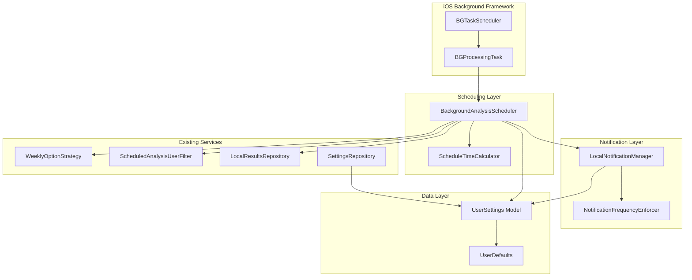
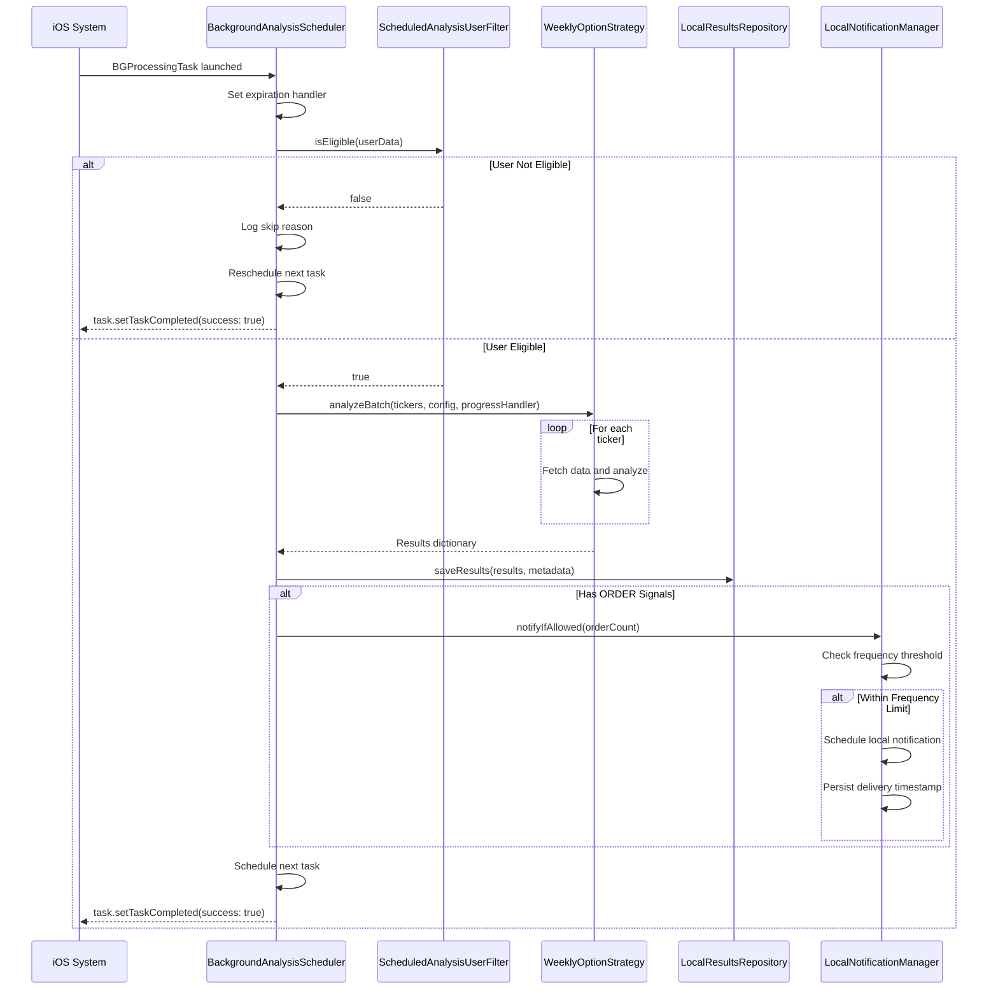
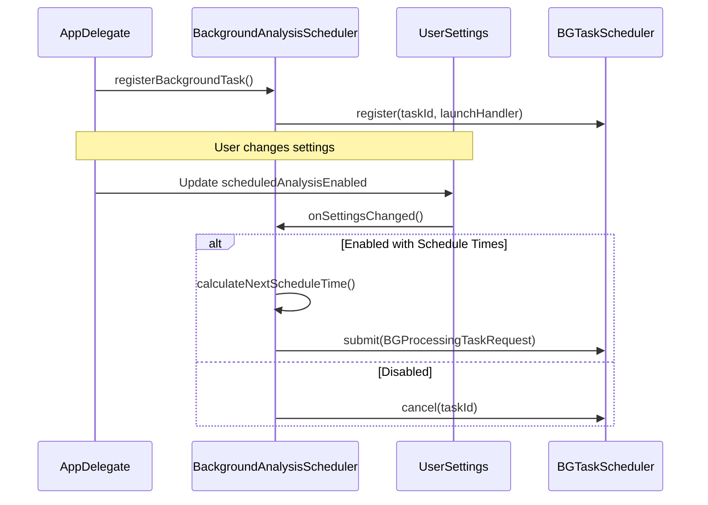

# Technical Design Document: Scheduled Analysis Notifications

## Overview

This document describes the technical design for implementing automated background analysis execution on iOS using BGProcessingTask, combined with local push notifications to alert users when ORDER signals are found. The feature integrates with the existing `WeeklyOptionStrategy.analyzeBatch()` analysis engine, `LocalResultsRepository` for persistence, and `ScheduledAnalysisUserFilter` for eligibility verification.

### Key Design Decisions

1. **BGProcessingTask over BGAppRefreshTask**: BGProcessingTask is chosen because analysis can take several minutes (network requests + computation per ticker), which exceeds the ~30-second limit of BGAppRefreshTask
2. **Local Notifications**: Local notifications are used since the analysis runs on-device; no server push infrastructure is needed
3. **UserDefaults for Settings Persistence**: Schedule times and notification preferences are stored in UserDefaults for simplicity and reliability
4. **Protocol-Oriented Design**: All new components follow the existing protocol-oriented architecture for testability and flexibility

## Architecture

### System Components



### Background Task Execution Flow



### App Launch and Settings Change Flow



## Components and Interfaces

### BackgroundAnalysisScheduler

The central coordinator for background task registration, scheduling, and execution.

```swift
// MARK: - Background Analysis Scheduler Protocol

/// Protocol for background analysis scheduling operations.
/// - Validates: Requirement 1.1-1.8 (Background task registration and scheduling)
protocol BackgroundAnalysisScheduling {
    /// Registers the background task with iOS BackgroundTasks framework.
    /// Must be called during app launch (before application:didFinishLaunchingWithOptions returns).
    func registerBackgroundTask()
    
    /// Schedules or cancels background tasks based on current settings.
    /// - Parameter settings: The current user settings
    func updateScheduling(for settings: UserSettings)
    
    /// Cancels all pending background task requests.
    func cancelPendingTasks()
    
    /// Handles the background task execution.
    /// - Parameter task: The BGProcessingTask provided by iOS
    func handleBackgroundTask(_ task: Any)
}

// MARK: - Background Analysis Scheduler Implementation

/// Implementation of background analysis scheduling using iOS BGProcessingTask.
///
/// Responsibilities:
/// - Register BGProcessingTask with identifier "com.tradingguru.scheduledAnalysis"
/// - Schedule tasks at user-configured times
/// - Execute analysis using WeeklyOptionStrategy.analyzeBatch()
/// - Persist results using LocalResultsRepository
/// - Trigger notifications via LocalNotificationManager
///
/// - Validates: Requirements 1.1-1.8 (Background task management)
/// - Validates: Requirements 5.1-5.8 (Integration with existing infrastructure)
/// - Validates: Requirements 6.1-6.6 (Error handling and resilience)
final class BackgroundAnalysisScheduler: BackgroundAnalysisScheduling {
    
    // MARK: - Constants
    
    /// The unique identifier for the background processing task.
    /// Must match the identifier in Info.plist BGTaskSchedulerPermittedIdentifiers.
    static let taskIdentifier = "com.tradingguru.scheduledAnalysis"
    
    // MARK: - Dependencies
    
    private let userFilter: ScheduledAnalysisUserFilter
    private let strategy: WeeklyOptionStrategy
    private let resultsRepository: ResultsRepository
    private let settingsRepository: SettingsRepository
    private let notificationManager: LocalNotificationManaging
    private let scheduleCalculator: ScheduleTimeCalculating
    private let logger: BackgroundTaskLogger
    
    // MARK: - State
    
    private var currentUserId: String?
    
    // MARK: - Initialization
    
    init(
        userFilter: ScheduledAnalysisUserFilter = ScheduledAnalysisUserFilter(),
        strategy: WeeklyOptionStrategy = WeeklyOptionStrategy(),
        resultsRepository: ResultsRepository = LocalResultsRepository(),
        settingsRepository: SettingsRepository,
        notificationManager: LocalNotificationManaging,
        scheduleCalculator: ScheduleTimeCalculating = ScheduleTimeCalculator(),
        logger: BackgroundTaskLogger = DefaultBackgroundTaskLogger()
    ) {
        self.userFilter = userFilter
        self.strategy = strategy
        self.resultsRepository = resultsRepository
        self.settingsRepository = settingsRepository
        self.notificationManager = notificationManager
        self.scheduleCalculator = scheduleCalculator
        self.logger = logger
    }
    
    // MARK: - Registration
    
    /// Registers the background task with iOS.
    /// - Validates: Requirement 1.1 (Register BGProcessingTask on app launch)
    func registerBackgroundTask() {
        BGTaskScheduler.shared.register(
            forTaskWithIdentifier: Self.taskIdentifier,
            using: nil
        ) { [weak self] task in
            guard let processingTask = task as? BGProcessingTask else { return }
            self?.handleBackgroundTask(processingTask)
        }
        logger.logRegistration(taskId: Self.taskIdentifier)
    }
    
    // MARK: - Scheduling
    
    /// Updates scheduling based on user settings.
    /// - Validates: Requirement 1.2, 1.6 (Submit/cancel based on settings)
    func updateScheduling(for settings: UserSettings) {
        if settings.scheduledAnalysisEnabled && !settings.scheduleTimes.isEmpty {
            scheduleNextTask(settings: settings)
        } else {
            cancelPendingTasks()
        }
    }
    
    /// Schedules the next background task occurrence.
    /// - Validates: Requirement 1.3, 1.4 (earliestBeginDate and requiresNetworkConnectivity)
    private func scheduleNextTask(settings: UserSettings) {
        let request = BGProcessingTaskRequest(identifier: Self.taskIdentifier)
        
        // Calculate next schedule time
        let nextTime = scheduleCalculator.calculateNextOccurrence(
            from: Date(),
            scheduleTimes: settings.scheduleTimes
        )
        request.earliestBeginDate = nextTime
        
        // Network is required for fetching market data
        request.requiresNetworkConnectivity = true
        
        do {
            try BGTaskScheduler.shared.submit(request)
            logger.logScheduled(taskId: Self.taskIdentifier, scheduledFor: nextTime)
        } catch {
            logger.logSchedulingError(taskId: Self.taskIdentifier, error: error)
        }
    }
    
    /// Cancels all pending background tasks.
    /// - Validates: Requirement 1.6, 5.7 (Cancel when disabled)
    func cancelPendingTasks() {
        BGTaskScheduler.shared.cancel(taskRequestWithIdentifier: Self.taskIdentifier)
        logger.logCancellation(taskId: Self.taskIdentifier)
    }
}
```

### ScheduleTimeCalculator

Calculates the next occurrence of a scheduled time.

```swift
// MARK: - Schedule Time Calculator Protocol

/// Protocol for calculating next schedule time occurrences.
protocol ScheduleTimeCalculating {
    /// Calculates the next occurrence of any configured schedule time.
    /// - Parameters:
    ///   - now: The current date/time
    ///   - scheduleTimes: Array of configured schedule times
    /// - Returns: The next Date when analysis should run
    func calculateNextOccurrence(from now: Date, scheduleTimes: [ScheduleTime]) -> Date
}

// MARK: - Schedule Time Calculator Implementation

/// Calculates next occurrences of user-configured schedule times.
///
/// Algorithm:
/// 1. For each schedule time, calculate when it next occurs
/// 2. If the time has passed today, use tomorrow
/// 3. Return the earliest of all calculated times
///
/// - Validates: Requirement 1.3 (earliestBeginDate calculation)
struct ScheduleTimeCalculator: ScheduleTimeCalculating {
    
    private let calendar: Calendar
    
    init(calendar: Calendar = .current) {
        self.calendar = calendar
    }
    
    /// Calculates the next occurrence of any scheduled time.
    /// - Validates: Requirement 1.3 (Next occurrence of user-configured schedule time)
    func calculateNextOccurrence(from now: Date, scheduleTimes: [ScheduleTime]) -> Date {
        guard !scheduleTimes.isEmpty else {
            // Fallback: schedule for tomorrow at 6:30 AM
            return calendar.date(byAdding: .day, value: 1, to: now) ?? now
        }
        
        let nextOccurrences = scheduleTimes.map { scheduleTime in
            calculateNextOccurrence(for: scheduleTime, from: now)
        }
        
        return nextOccurrences.min() ?? now
    }
    
    /// Calculates the next occurrence for a single schedule time.
    private func calculateNextOccurrence(for scheduleTime: ScheduleTime, from now: Date) -> Date {
        var components = calendar.dateComponents([.year, .month, .day], from: now)
        components.hour = scheduleTime.hour
        components.minute = scheduleTime.minute
        components.second = 0
        
        guard let candidateDate = calendar.date(from: components) else {
            return now
        }
        
        // If the time has already passed today, schedule for tomorrow
        if candidateDate <= now {
            return calendar.date(byAdding: .day, value: 1, to: candidateDate) ?? candidateDate
        }
        
        return candidateDate
    }
}
```

### LocalNotificationManager

Manages local notification permissions and delivery.

```swift
// MARK: - Local Notification Manager Protocol

/// Protocol for local notification management.
/// - Validates: Requirements 3.1-3.8 (Local notification permission and delivery)
/// - Validates: Requirements 4.1-4.7 (Notification frequency control)
protocol LocalNotificationManaging {
    /// Requests notification authorization from the user.
    /// - Returns: True if authorization was granted
    func requestAuthorization() async -> Bool
    
    /// Checks if notifications are currently authorized.
    func checkAuthorizationStatus() async -> NotificationAuthorizationStatus
    
    /// Attempts to deliver a notification for analysis results.
    /// Respects notification frequency settings.
    /// - Parameters:
    ///   - orderCount: Number of ORDER signals found
    ///   - settings: Current user settings with frequency preference
    /// - Returns: True if notification was delivered
    @discardableResult
    func notifyIfAllowed(orderCount: Int, settings: UserSettings) async -> Bool
}

/// Notification authorization status.
enum NotificationAuthorizationStatus {
    case authorized
    case denied
    case notDetermined
    case provisional
}

// MARK: - Local Notification Manager Implementation

/// Implementation of local notification management using UNUserNotificationCenter.
///
/// Handles:
/// - Permission requests with alert, sound, and badge options
/// - Notification content formatting
/// - Frequency-based delivery suppression
/// - Deep linking to results screen
///
/// - Validates: Requirements 3.1-3.8 (Notification delivery)
/// - Validates: Requirements 4.1-4.7 (Frequency control)
final class LocalNotificationManager: LocalNotificationManaging {
    
    // MARK: - Constants
    
    /// Notification category identifier for analysis complete notifications.
    static let analysisCategoryId = "ANALYSIS_COMPLETE"
    
    /// Key for storing last notification timestamp.
    private static let lastNotificationKey = "tradingguru.lastNotificationTimestamp"
    
    // MARK: - Dependencies
    
    private let notificationCenter: UNUserNotificationCenter
    private let frequencyEnforcer: NotificationFrequencyEnforcing
    private let userDefaults: UserDefaults
    
    // MARK: - Initialization
    
    init(
        notificationCenter: UNUserNotificationCenter = .current(),
        frequencyEnforcer: NotificationFrequencyEnforcing = NotificationFrequencyEnforcer(),
        userDefaults: UserDefaults = .standard
    ) {
        self.notificationCenter = notificationCenter
        self.frequencyEnforcer = frequencyEnforcer
        self.userDefaults = userDefaults
    }
    
    // MARK: - Authorization
    
    /// Requests notification authorization with alert, sound, and badge options.
    /// - Validates: Requirement 3.1 (Request authorization on first enable)
    func requestAuthorization() async -> Bool {
        do {
            let granted = try await notificationCenter.requestAuthorization(
                options: [.alert, .sound, .badge]
            )
            return granted
        } catch {
            return false
        }
    }
    
    /// Checks current authorization status.
    /// - Validates: Requirement 3.2 (Handle permission denial)
    func checkAuthorizationStatus() async -> NotificationAuthorizationStatus {
        let settings = await notificationCenter.notificationSettings()
        switch settings.authorizationStatus {
        case .authorized: return .authorized
        case .denied: return .denied
        case .notDetermined: return .notDetermined
        case .provisional: return .provisional
        @unknown default: return .notDetermined
        }
    }
    
    // MARK: - Notification Delivery
    
    /// Delivers a notification if allowed by frequency settings.
    /// - Validates: Requirement 3.3, 3.7 (Deliver only when ORDER signals found)
    /// - Validates: Requirement 4.3, 4.4, 4.5 (Frequency enforcement)
    @discardableResult
    func notifyIfAllowed(orderCount: Int, settings: UserSettings) async -> Bool {
        // Don't notify if no ORDER signals
        guard orderCount > 0 else { return false }
        
        // Check frequency enforcement
        let lastNotification = getLastNotificationTimestamp()
        guard frequencyEnforcer.shouldDeliver(
            lastNotificationTime: lastNotification,
            frequency: settings.notificationFrequency,
            currentTime: Date()
        ) else {
            return false
        }
        
        // Create and deliver notification
        let content = createNotificationContent(orderCount: orderCount)
        let request = UNNotificationRequest(
            identifier: UUID().uuidString,
            content: content,
            trigger: nil // Deliver immediately
        )
        
        do {
            try await notificationCenter.add(request)
            persistNotificationTimestamp(Date())
            return true
        } catch {
            return false
        }
    }
    
    // MARK: - Content Creation
    
    /// Creates notification content for analysis results.
    /// - Validates: Requirement 3.4, 3.5, 3.8 (Content format, badge, sound)
    private func createNotificationContent(orderCount: Int) -> UNMutableNotificationContent {
        let content = UNMutableNotificationContent()
        content.title = "TradingGuru Analysis Complete"
        content.body = "\(orderCount) ORDER signals found! Tap to review."
        content.badge = NSNumber(value: orderCount)
        content.sound = .default
        content.categoryIdentifier = Self.analysisCategoryId
        content.userInfo = ["action": "showResults"]
        return content
    }
    
    // MARK: - Timestamp Persistence
    
    /// Gets the last notification delivery timestamp.
    private func getLastNotificationTimestamp() -> Date? {
        userDefaults.object(forKey: Self.lastNotificationKey) as? Date
    }
    
    /// Persists the notification delivery timestamp.
    /// - Validates: Requirement 4.5 (Persist delivery timestamp)
    private func persistNotificationTimestamp(_ date: Date) {
        userDefaults.set(date, forKey: Self.lastNotificationKey)
    }
}
```


### NotificationFrequencyEnforcer

Enforces notification frequency limits.

```swift
// MARK: - Notification Frequency Enforcer Protocol

/// Protocol for enforcing notification frequency limits.
protocol NotificationFrequencyEnforcing {
    /// Determines if a notification should be delivered based on frequency settings.
    /// - Parameters:
    ///   - lastNotificationTime: When the last notification was delivered
    ///   - frequency: The configured frequency setting
    ///   - currentTime: The current time
    /// - Returns: True if notification should be delivered
    func shouldDeliver(
        lastNotificationTime: Date?,
        frequency: NotificationFrequency,
        currentTime: Date
    ) -> Bool
}

// MARK: - Notification Frequency Enforcer Implementation

/// Enforces notification frequency limits based on user preferences.
///
/// - Validates: Requirements 4.3, 4.4, 4.7 (Frequency enforcement logic)
struct NotificationFrequencyEnforcer: NotificationFrequencyEnforcing {
    
    /// Determines if sufficient time has elapsed since the last notification.
    /// - Validates: Requirement 4.4 (Suppress if elapsed < interval)
    /// - Validates: Requirement 4.7 (No suppression for "Every time")
    func shouldDeliver(
        lastNotificationTime: Date?,
        frequency: NotificationFrequency,
        currentTime: Date
    ) -> Bool {
        // "Every time" means no frequency limiting
        guard frequency != .everyTime else { return true }
        
        // First notification always allowed
        guard let lastTime = lastNotificationTime else { return true }
        
        let elapsed = currentTime.timeIntervalSince(lastTime)
        return elapsed >= frequency.minimumInterval
    }
}
```

## Data Models

### UserSettings Extensions

Extensions to the existing UserSettings model for schedule and notification preferences.

```swift
// MARK: - Schedule Time Model

/// Represents a scheduled time for background analysis.
/// - Validates: Requirement 2.2 (15-minute increments, 00:00-23:45)
struct ScheduleTime: Codable, Equatable, Hashable {
    /// Hour component (0-23)
    let hour: Int
    
    /// Minute component (0, 15, 30, or 45)
    let minute: Int
    
    /// Creates a ScheduleTime with validation.
    /// - Parameters:
    ///   - hour: Hour (0-23)
    ///   - minute: Minute (must be 0, 15, 30, or 45)
    /// - Returns: ScheduleTime if valid, nil otherwise
    static func create(hour: Int, minute: Int) -> ScheduleTime? {
        guard (0...23).contains(hour) else { return nil }
        guard [0, 15, 30, 45].contains(minute) else { return nil }
        return ScheduleTime(hour: hour, minute: minute)
    }
    
    /// Valid minute increments for schedule times.
    static let validMinutes = [0, 15, 30, 45]
    
    /// Display string in HH:MM format.
    var displayString: String {
        String(format: "%02d:%02d", hour, minute)
    }
    
    /// Display string with AM/PM format.
    var displayStringWithPeriod: String {
        let period = hour < 12 ? "AM" : "PM"
        let displayHour = hour == 0 ? 12 : (hour > 12 ? hour - 12 : hour)
        return String(format: "%d:%02d %@", displayHour, minute, period)
    }
    
    /// Private initializer - use create() factory method.
    private init(hour: Int, minute: Int) {
        self.hour = hour
        self.minute = minute
    }
}

// MARK: - Notification Frequency Model

/// Frequency options for notification delivery.
/// - Validates: Requirement 4.1 (Frequency options)
enum NotificationFrequency: String, Codable, CaseIterable {
    case everyTime = "every_time"
    case atMostOncePerThirtyMinutes = "30_minutes"
    case atMostOncePerHour = "1_hour"
    case atMostOncePerTwoHours = "2_hours"
    case atMostOncePerFourHours = "4_hours"
    case atMostOncePerDay = "24_hours"
    
    /// Minimum interval in seconds before next notification.
    var minimumInterval: TimeInterval {
        switch self {
        case .everyTime: return 0
        case .atMostOncePerThirtyMinutes: return 30 * 60
        case .atMostOncePerHour: return 60 * 60
        case .atMostOncePerTwoHours: return 2 * 60 * 60
        case .atMostOncePerFourHours: return 4 * 60 * 60
        case .atMostOncePerDay: return 24 * 60 * 60
        }
    }
    
    /// Display label for UI.
    var displayLabel: String {
        switch self {
        case .everyTime: return "Every time"
        case .atMostOncePerThirtyMinutes: return "At most once per 30 minutes"
        case .atMostOncePerHour: return "At most once per hour"
        case .atMostOncePerTwoHours: return "At most once per 2 hours"
        case .atMostOncePerFourHours: return "At most once per 4 hours"
        case .atMostOncePerDay: return "At most once per day"
        }
    }
    
    /// Default frequency for new users.
    /// - Validates: Requirement 4.2 (Default is once per hour)
    static let `default` = NotificationFrequency.atMostOncePerHour
}

// MARK: - Extended UserSettings Model

/// Extended UserSettings with schedule and notification fields.
/// - Validates: Requirement 5.6 (New fields added to existing model)
extension UserSettings {
    
    // Note: These properties would be added to the existing UserSettings struct.
    // Shown here as extension for documentation purposes.
    
    /*
    /// Configured schedule times for background analysis.
    /// - Validates: Requirement 2.5 (1-8 schedule times)
    var scheduleTimes: [ScheduleTime]
    
    /// Notification frequency preference.
    /// - Validates: Requirement 4.6 (Persisted to settings)
    var notificationFrequency: NotificationFrequency
    */
}


// MARK: - UserSettings Schedule Management

/// Errors that can occur during schedule time management.
enum ScheduleTimeError: Error, Equatable {
    case maximumLimitReached(max: Int)
    case invalidTime
    case duplicateTime
    case minimumRequired
}

extension ScheduleTimeError: LocalizedError {
    var errorDescription: String? {
        switch self {
        case .maximumLimitReached(let max):
            return "Maximum of \(max) schedule times allowed."
        case .invalidTime:
            return "Invalid time. Please select a time in 15-minute increments."
        case .duplicateTime:
            return "This time is already scheduled."
        case .minimumRequired:
            return "At least one schedule time is required when scheduled analysis is enabled."
        }
    }
}

/// Protocol for managing schedule times in UserSettings.
protocol ScheduleTimeManaging {
    /// Maximum number of schedule times allowed.
    static var maxScheduleTimes: Int { get }
    
    /// Default schedule times for new users.
    static var defaultScheduleTimes: [ScheduleTime] { get }
    
    /// Adds a schedule time.
    /// - Validates: Requirement 2.3, 2.5, 2.6 (Add with limits)
    mutating func addScheduleTime(_ time: ScheduleTime) -> Result<Void, ScheduleTimeError>
    
    /// Removes a schedule time.
    /// - Validates: Requirement 2.4 (Remove from storage)
    mutating func removeScheduleTime(_ time: ScheduleTime) -> Bool
}
```

### Background Task Logger

Logging interface for debugging background task operations.

```swift
// MARK: - Background Task Logger Protocol

/// Protocol for logging background task operations.
/// - Validates: Requirement 6.6 (Log all task operations)
protocol BackgroundTaskLogger {
    func logRegistration(taskId: String)
    func logScheduled(taskId: String, scheduledFor: Date)
    func logSchedulingError(taskId: String, error: Error)
    func logCancellation(taskId: String)
    func logExecutionStarted(taskId: String)
    func logExecutionCompleted(taskId: String, resultsCount: Int, errorsCount: Int)
    func logExecutionFailed(taskId: String, error: Error)
    func logEligibilitySkipped(taskId: String, reason: String)
    func logPartialResultsSaved(taskId: String, savedCount: Int)
}

// MARK: - Default Background Task Logger

/// Default implementation using os_log for background task logging.
struct DefaultBackgroundTaskLogger: BackgroundTaskLogger {
    
    private let subsystem = "com.tradingguru"
    private let category = "BackgroundTask"
    
    func logRegistration(taskId: String) {
        print("[BGTask] Registered: \(taskId)")
    }
    
    func logScheduled(taskId: String, scheduledFor: Date) {
        let formatter = ISO8601DateFormatter()
        print("[BGTask] Scheduled \(taskId) for \(formatter.string(from: scheduledFor))")
    }
    
    func logSchedulingError(taskId: String, error: Error) {
        print("[BGTask] Scheduling error for \(taskId): \(error.localizedDescription)")
    }
    
    func logCancellation(taskId: String) {
        print("[BGTask] Cancelled: \(taskId)")
    }
    
    func logExecutionStarted(taskId: String) {
        print("[BGTask] Execution started: \(taskId)")
    }
    
    func logExecutionCompleted(taskId: String, resultsCount: Int, errorsCount: Int) {
        print("[BGTask] Execution completed: \(taskId) - Results: \(resultsCount), Errors: \(errorsCount)")
    }
    
    func logExecutionFailed(taskId: String, error: Error) {
        print("[BGTask] Execution failed: \(taskId) - \(error.localizedDescription)")
    }
    
    func logEligibilitySkipped(taskId: String, reason: String) {
        print("[BGTask] Skipped \(taskId): \(reason)")
    }
    
    func logPartialResultsSaved(taskId: String, savedCount: Int) {
        print("[BGTask] Partial results saved for \(taskId): \(savedCount) items")
    }
}
```

## Error Handling

### Background Task Error Handling

| Error Scenario | Handling Strategy | Recovery Action |
|----------------|-------------------|-----------------|
| Network unavailable at execution | Mark task as failed | iOS reschedules automatically (Req 6.1) |
| Individual ticker fetch fails | Continue with remaining tickers | Include partial results (Req 6.2) |
| Results save fails | Log error | Retry on next successful run (Req 6.3) |
| Task expiration imminent | Graceful termination | Save partial results (Req 6.4) |
| All tickers fail | Skip notification | Reschedule for next time (Req 6.5) |
| Empty watchlist | Skip analysis | Log and reschedule (Req 5.8) |

### Task Expiration Handler

```swift
/// Sets up the expiration handler for graceful termination.
/// - Validates: Requirement 6.4 (Expiration handler)
private func setupExpirationHandler(
    task: BGProcessingTask,
    analysisTask: Task<Void, Never>
) {
    task.expirationHandler = { [weak self] in
        // Cancel the analysis task
        analysisTask.cancel()
        
        // Save any partial results that were collected
        self?.savePartialResults()
        
        // Mark task as needing to be rescheduled
        task.setTaskCompleted(success: false)
    }
}
```

## Integration Points

### Info.plist Configuration

```xml
<!-- Required entries in Info.plist -->
<key>BGTaskSchedulerPermittedIdentifiers</key>
<array>
    <string>com.tradingguru.scheduledAnalysis</string>
</array>

<key>UIBackgroundModes</key>
<array>
    <string>processing</string>
</array>
```


### AppDelegate Integration

```swift
// In AppDelegate.swift

func application(
    _ application: UIApplication,
    didFinishLaunchingWithOptions launchOptions: [UIApplication.LaunchOptionsKey: Any]?
) -> Bool {
    // Register background task before returning
    // - Validates: Requirement 1.1 (Register on app launch)
    BackgroundAnalysisScheduler.shared.registerBackgroundTask()
    
    return true
}
```

### Notification Center Delegate

```swift
// In SceneDelegate or AppDelegate

extension AppDelegate: UNUserNotificationCenterDelegate {
    
    /// Handles notification tap to navigate to results screen.
    /// - Validates: Requirement 3.6 (Navigate to results on tap)
    func userNotificationCenter(
        _ center: UNUserNotificationCenter,
        didReceive response: UNNotificationResponse,
        withCompletionHandler completionHandler: @escaping () -> Void
    ) {
        if response.notification.request.content.categoryIdentifier == LocalNotificationManager.analysisCategoryId {
            // Navigate to results screen
            NotificationCenter.default.post(
                name: .showAnalysisResults,
                object: nil
            )
        }
        completionHandler()
    }
}

extension Notification.Name {
    static let showAnalysisResults = Notification.Name("showAnalysisResults")
}
```

### Settings View Integration

```swift
// Settings view observation for scheduling updates

struct ScheduleSettingsView: View {
    @StateObject private var viewModel: ScheduleSettingsViewModel
    
    var body: some View {
        Form {
            Section("Schedule Times") {
                ForEach(viewModel.scheduleTimes, id: \.self) { time in
                    ScheduleTimeRow(time: time)
                        .swipeActions {
                            Button(role: .destructive) {
                                viewModel.removeScheduleTime(time)
                            } label: {
                                Label("Delete", systemImage: "trash")
                            }
                        }
                }
                
                if viewModel.canAddMoreTimes {
                    Button("Add Schedule Time") {
                        viewModel.showTimePicker = true
                    }
                }
            }
            
            Section("Notifications") {
                Picker("Frequency", selection: $viewModel.notificationFrequency) {
                    ForEach(NotificationFrequency.allCases, id: \.self) { frequency in
                        Text(frequency.displayLabel).tag(frequency)
                    }
                }
            }
        }
        .onChange(of: viewModel.scheduleTimes) { _ in
            viewModel.updateBackgroundScheduling()
        }
        .onChange(of: viewModel.notificationFrequency) { _ in
            viewModel.saveSettings()
        }
    }
}
```


## Correctness Properties

*A property is a characteristic or behavior that should hold true across all valid executions of a system—essentially, a formal statement about what the system should do. Properties serve as the bridge between human-readable specifications and machine-verifiable correctness guarantees.*

### Property Reflection

After analyzing all acceptance criteria, I identified properties suitable for property-based testing. The following consolidations were made:

- Requirements 2.3 and 4.6 both test round-trip persistence; consolidated into two separate properties as they test different data types (schedule times vs. notification frequency)
- Requirements 3.3 and 3.7 are logically related (notification delivery based on ORDER count); consolidated into a single property
- Requirements 3.4 and 3.5 test notification content formatting; consolidated into a single comprehensive property

### Property 1: Next Schedule Time Calculation

*For any* current time and non-empty array of schedule times, the calculated next occurrence SHALL be:
1. Greater than the current time
2. Equal to one of the configured schedule times (hour and minute match)
3. The minimum (earliest) among all possible next occurrences

**Validates: Requirements 1.3**

### Property 2: Schedule Time Validation

*For any* hour value in range [0, 23] and minute value in [0, 15, 30, 45], creating a ScheduleTime SHALL succeed. *For any* values outside these ranges, creation SHALL fail.

**Validates: Requirements 2.2**

### Property 3: Schedule Time Persistence Round Trip

*For any* valid ScheduleTime, adding it to UserSettings and then retrieving the schedule times SHALL include the original time with identical hour and minute values.

**Validates: Requirements 2.3**

### Property 4: Schedule Time Removal

*For any* UserSettings containing one or more schedule times, removing a time that exists in the list SHALL result in that time no longer appearing in the schedule times, and the list length SHALL decrease by one.

**Validates: Requirements 2.4**

### Property 5: Schedule Times Count Constraint

*For any* UserSettings, the schedule times array length SHALL be between 0 and 8 inclusive. Adding a schedule time when the count is already 8 SHALL fail with maximumLimitReached error.

**Validates: Requirements 2.5, 2.6**


### Property 6: Notification Delivery Based on ORDER Count

*For any* analysis results array, a notification SHALL be created if and only if the count of results with signal == .order is greater than zero.

**Validates: Requirements 3.3, 3.7**

### Property 7: Notification Content Format

*For any* positive integer N representing ORDER signal count, the notification content SHALL have:
1. Title equal to "TradingGuru Analysis Complete"
2. Body matching the pattern "[N] ORDER signals found! Tap to review." where [N] is the actual count
3. Badge count equal to N

**Validates: Requirements 3.4, 3.5**

### Property 8: Notification Frequency Enforcement

*For any* last notification timestamp T, current time C, and notification frequency F where F != .everyTime, a notification SHALL be suppressed if (C - T) < F.minimumInterval. When F == .everyTime, notifications SHALL never be suppressed.

**Validates: Requirements 4.4, 4.7**

### Property 9: Notification Frequency Persistence Round Trip

*For any* NotificationFrequency value, saving it to UserSettings and then retrieving it SHALL return the same frequency value.

**Validates: Requirements 4.6**

### Property 10: Partial Results Processing

*For any* batch of tickers where some fail and some succeed during analysis, the results array SHALL contain entries for all successful tickers, and the count of successful results SHALL equal the count of tickers that did not throw errors.

**Validates: Requirements 6.2**

## Testing Strategy

### Unit Testing

Unit tests will cover specific examples and edge cases using XCTest framework.

**Background Scheduler Tests:**
- Test task registration occurs on initialization
- Test scheduling updates when settings change
- Test cancellation when disabled
- Test expiration handler saves partial results

**Schedule Calculator Tests:**
- Test next occurrence calculation with single time
- Test next occurrence calculation with multiple times
- Test rollover to next day when time has passed
- Test edge cases: midnight, end of day

**Notification Manager Tests:**
- Test permission request flow
- Test notification content creation
- Test frequency enforcement
- Test deep link handling

**UserSettings Extensions Tests:**
- Test default schedule times (6:30 AM, 12:30 PM)
- Test default notification frequency (once per hour)
- Test schedule time add/remove operations
- Test maximum limit enforcement

### Property-Based Testing

Property-based tests will use the Swift property-testing framework.


**Configuration:**
- Minimum 100 iterations per property test
- Each test tagged with property reference

**Property Tests to Implement:**

| Property | Test File | Description |
|----------|-----------|-------------|
| Property 1 | `ScheduleTimeCalculatorPropertyTests.swift` | Next schedule time calculation |
| Property 2 | `ScheduleTimePropertyTests.swift` | Schedule time validation |
| Property 3 | `UserSettingsPropertyTests.swift` | Schedule time persistence round trip |
| Property 4 | `UserSettingsPropertyTests.swift` | Schedule time removal |
| Property 5 | `UserSettingsPropertyTests.swift` | Schedule times count constraint |
| Property 6 | `LocalNotificationManagerPropertyTests.swift` | Notification delivery based on ORDER count |
| Property 7 | `LocalNotificationManagerPropertyTests.swift` | Notification content format |
| Property 8 | `NotificationFrequencyEnforcerPropertyTests.swift` | Notification frequency enforcement |
| Property 9 | `UserSettingsPropertyTests.swift` | Notification frequency persistence |
| Property 10 | `BackgroundAnalysisSchedulerPropertyTests.swift` | Partial results processing |

### Integration Testing

Integration tests verify component interactions:

**Background Task Integration:**
- Test full execution flow with mocked BGProcessingTask
- Test settings change triggers scheduling update
- Test results persistence after analysis completion

**Notification Integration:**
- Test notification delivery after successful analysis
- Test notification suppression based on frequency
- Test deep link navigation to results screen

### Manual Testing Checklist

Due to iOS background task limitations, some behaviors require manual testing:

- [ ] Verify BGProcessingTask executes when device is idle and charging
- [ ] Verify notification appears when analysis completes with ORDER signals
- [ ] Verify notification tap opens results screen
- [ ] Verify schedule time picker shows 15-minute increments
- [ ] Verify notification frequency settings persist across app restarts
- [ ] Test behavior when notification permission is denied
- [ ] Test behavior when network becomes unavailable during analysis
