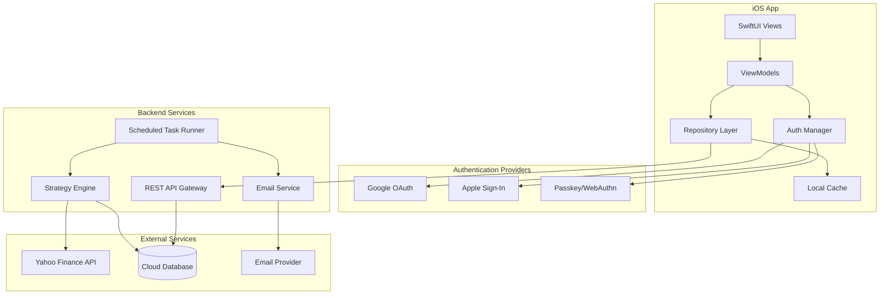
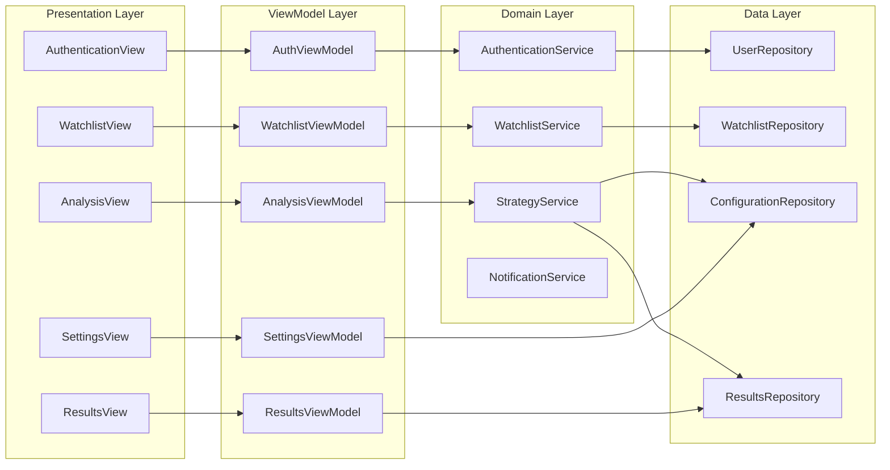
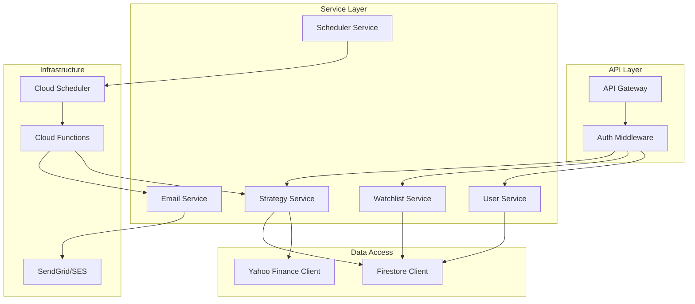
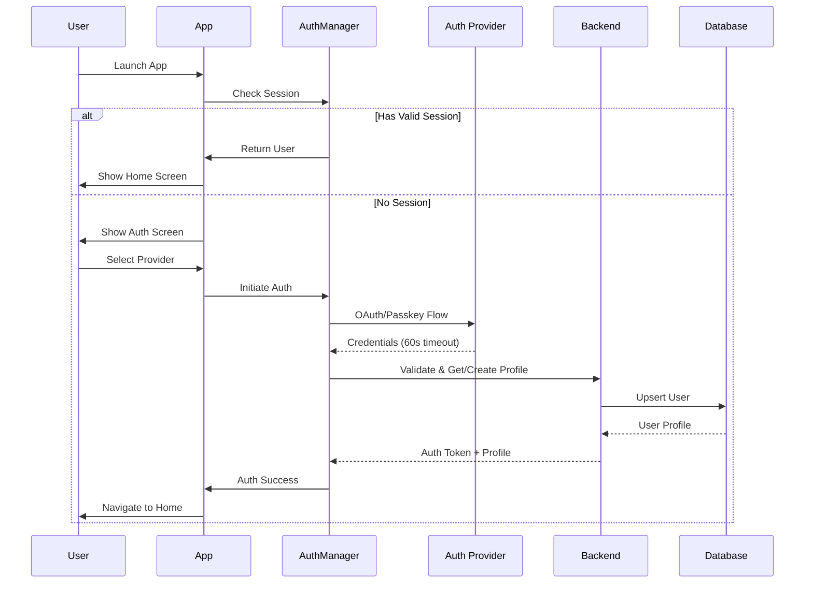
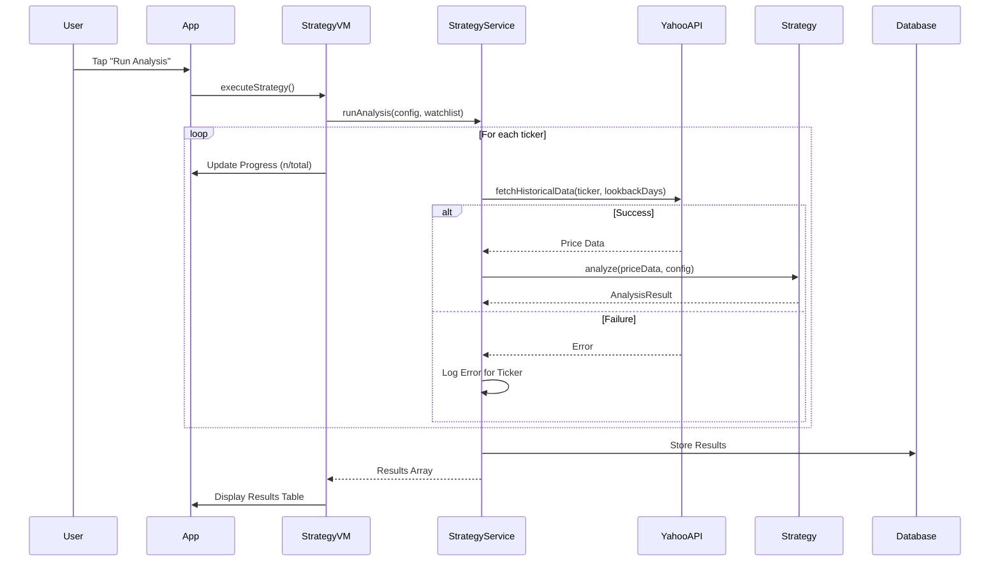

# Technical Design Document: TradingGuru iOS App

## Overview

TradingGuru is an iOS stock trading analysis application built with SwiftUI that enables users to run customizable trading strategies on personal stock watchlists. The system consists of two main components:

1. **iOS Client Application**: A SwiftUI-based mobile app providing user authentication, watchlist management, strategy configuration, and results visualization
2. **Backend Service**: A cloud-based service handling scheduled analysis execution, data fetching from Yahoo Finance, result persistence, and email notifications

### High-Level Architecture



### Key Design Decisions

1. **MVVM Architecture**: The iOS app follows Model-View-ViewModel pattern for clean separation of concerns and testability
2. **Repository Pattern**: Abstracts data source details from ViewModels, enabling offline-first behavior with local caching
3. **Protocol-Oriented Strategy Design**: Strategies implement a common `TradingStrategy` protocol, enabling extensibility without modifying existing code
4. **Backend-Driven Scheduling**: Scheduled analysis runs on the backend to ensure reliability regardless of app state
5. **Cloud Database**: Firestore or similar NoSQL database for real-time sync and offline support

## Architecture

### System Components



### Backend Architecture



### Authentication Flow



### Strategy Execution Flow



## Components and Interfaces

### iOS App Components

#### Authentication Module

```swift
// MARK: - Authentication Protocols

protocol AuthenticationProvider {
    func signIn() async throws -> AuthCredential
    func signOut() async throws
    var providerType: AuthProviderType { get }
}

protocol AuthenticationService {
    var currentUser: User? { get }
    var isAuthenticated: Bool { get }
    var sessionExpirationDate: Date? { get }
    
    func signIn(with provider: AuthProviderType) async throws -> User
    func signOut() async throws
    func refreshSession() async throws
}

enum AuthProviderType: String, CaseIterable {
    case google
    case apple
    case passkey
}

enum AuthError: Error {
    case invalidCredentials
    case networkError(underlying: Error)
    case providerUnavailable
    case timeout
    case profileOperationFailed
    case sessionExpired
}
```

#### Watchlist Module

```swift
// MARK: - Watchlist Protocols

protocol WatchlistRepository {
    func getWatchlist(for userId: String) async throws -> [String]
    func addSymbol(_ symbol: String, for userId: String) async throws
    func removeSymbol(_ symbol: String, for userId: String) async throws
}

protocol WatchlistValidation {
    func validateSymbol(_ symbol: String) -> Result<String, WatchlistError>
    func canAddSymbol(to watchlist: [String]) -> Bool
}

enum WatchlistError: Error {
    case invalidFormat
    case duplicateSymbol
    case limitReached(max: Int)
    case databaseUnavailable
}

// Symbol validation: 1-5 uppercase letters
extension String {
    var isValidTickerSymbol: Bool {
        let pattern = "^[A-Z]{1,5}$"
        return range(of: pattern, options: .regularExpression) != nil
    }
}
```

#### Strategy Module

```swift
// MARK: - Strategy Protocol (Extensible Architecture)

protocol TradingStrategy {
    var name: String { get }
    var identifier: String { get }
    var configurationSchema: StrategyConfigurationSchema { get }
    
    func analyze(
        priceData: [PricePoint],
        configuration: StrategyConfiguration
    ) -> AnalysisResult
}

protocol StrategyConfigurationSchema {
    var parameters: [ConfigurationParameter] { get }
    func validate(_ configuration: StrategyConfiguration) -> Result<Void, ConfigurationError>
}

struct ConfigurationParameter {
    let key: String
    let displayName: String
    let type: ParameterType
    let defaultValue: Any
    let constraints: ParameterConstraints?
}

enum ParameterType {
    case integer(options: [Int]?)
    case decimal(range: ClosedRange<Double>, step: Double)
    case boolean
}

// Weekly Option Strategy Implementation
class WeeklyOptionStrategy: TradingStrategy {
    let name = "Weekly Option Strategy"
    let identifier = "weekly_option"
    
    var configurationSchema: StrategyConfigurationSchema {
        WeeklyOptionConfigSchema()
    }
    
    func analyze(
        priceData: [PricePoint],
        configuration: StrategyConfiguration
    ) -> AnalysisResult {
        // Implementation details in Data Models section
    }
}
```

#### Data Service Module

```swift
// MARK: - Data Service

protocol MarketDataService {
    func fetchHistoricalPrices(
        ticker: String,
        lookbackDays: Int
    ) async throws -> [PricePoint]
    
    func fetchEarningsDate(ticker: String) async throws -> Date?
}

protocol DataServiceError: Error {
    var ticker: String { get }
    var underlyingError: Error? { get }
}

struct YahooFinanceService: MarketDataService {
    private let baseURL = "https://query1.finance.yahoo.com/v8/finance/chart/"
    
    func fetchHistoricalPrices(
        ticker: String,
        lookbackDays: Int
    ) async throws -> [PricePoint] {
        // Fetch closing prices for the specified lookback period
    }
    
    func fetchEarningsDate(ticker: String) async throws -> Date? {
        // Fetch next earnings date from Yahoo Finance
    }
}
```

#### Results Display Module

```swift
// MARK: - Results Display

protocol ResultsDisplay {
    var results: [AnalysisResultRow] { get }
    var sortColumn: ResultColumn { get set }
    var sortDirection: SortDirection { get set }
    var lastUpdated: Date? { get }
    
    func sort(by column: ResultColumn)
    func toggleSortDirection()
}

enum ResultColumn: String, CaseIterable {
    case ticker
    case type
    case returnPercentage
    case currentPrice
    case targetPrice
    case signal
    case nextEarningsDate
}

enum SortDirection {
    case ascending
    case descending
    
    mutating func toggle() {
        self = self == .ascending ? .descending : .ascending
    }
}
```

### Backend API Interfaces

```swift
// MARK: - REST API Endpoints

/*
 Base URL: https://api.tradingguru.app/v1
 
 Authentication:
 - All endpoints except /auth/* require Bearer token
 
 Endpoints:
 
 POST /auth/verify
   Body: { provider: string, credential: string }
   Response: { token: string, user: UserProfile }
 
 GET /users/{userId}/watchlist
   Response: { symbols: string[], updatedAt: timestamp }
 
 POST /users/{userId}/watchlist
   Body: { symbol: string }
   Response: { success: boolean }
 
 DELETE /users/{userId}/watchlist/{symbol}
   Response: { success: boolean }
 
 GET /users/{userId}/configuration/{strategyId}
   Response: { configuration: StrategyConfiguration, updatedAt: timestamp }
 
 PUT /users/{userId}/configuration/{strategyId}
   Body: { configuration: StrategyConfiguration }
   Response: { success: boolean, updatedAt: timestamp }
 
 POST /analysis/run
   Body: { userId: string, strategyId: string, configuration: object }
   Response: { results: AnalysisResult[], timestamp: timestamp }
 
 GET /users/{userId}/results/latest
   Response: { results: AnalysisResult[], timestamp: timestamp, source: "manual"|"scheduled" }
 
 PUT /users/{userId}/settings
   Body: { emailAddress?: string, emailNotifications?: boolean, scheduledAnalysis?: boolean }
   Response: { success: boolean }
*/
```

## Data Models

### Core Domain Models

```swift
// MARK: - User Models

struct User: Codable, Identifiable {
    let id: String
    let email: String?
    let displayName: String?
    let authProvider: AuthProviderType
    let createdAt: Date
    var lastLoginAt: Date
}

struct UserSettings: Codable {
    var notificationEmail: String?
    var emailNotificationsEnabled: Bool
    var scheduledAnalysisEnabled: Bool
    var updatedAt: Date
    
    static let `default` = UserSettings(
        notificationEmail: nil,
        emailNotificationsEnabled: true,
        scheduledAnalysisEnabled: true,
        updatedAt: Date()
    )
}

// MARK: - Watchlist Models

struct Watchlist: Codable {
    let userId: String
    var symbols: [String]
    var updatedAt: Date
    
    static let maxSymbols = 50
}

// MARK: - Strategy Configuration Models

struct StrategyConfiguration: Codable {
    let strategyId: String
    var parameters: [String: ConfigValue]
    var updatedAt: Date
}

enum ConfigValue: Codable, Equatable {
    case integer(Int)
    case decimal(Double)
    case boolean(Bool)
    case string(String)
}

struct WeeklyOptionConfiguration: Codable {
    var windowDays: Int          // 1, 5, or 30
    var lookbackDays: Int        // 30, 60, 90, 180, or 360
    var premiumPct: Double       // 0.1 to 5.0 (step 0.1)
    var onlyOrders: Bool         // Filter to show only ORDER signals
    
    static let `default` = WeeklyOptionConfiguration(
        windowDays: 5,
        lookbackDays: 180,
        premiumPct: 0.5,
        onlyOrders: false
    )
    
    static let validWindowDays = [1, 5, 30]
    static let validLookbackDays = [30, 60, 90, 180, 360]
    static let premiumPctRange = 0.1...5.0
    static let premiumPctStep = 0.1
}

// MARK: - Price Data Models

struct PricePoint: Codable {
    let date: Date
    let close: Double
}

// MARK: - Analysis Result Models

struct AnalysisResult: Codable, Identifiable {
    let id: UUID
    let ticker: String
    let type: OpportunityType
    let returnPercentage: Double
    let currentPrice: Double
    let targetPrice: Double
    let signal: Signal
    let nextEarningsDate: Date?
    let hasEarningsRisk: Bool    // true if earnings date <= expiration date
    let analyzedAt: Date
}

enum OpportunityType: String, Codable {
    case call = "CALL"
    case put = "PUT"
}

enum Signal: String, Codable {
    case order = "ORDER"
    case hold = "HOLD"
}

// MARK: - Scheduled Analysis Models

struct ScheduledRun: Codable {
    let id: String
    let userId: String
    let scheduledTime: Date
    let executedAt: Date
    let status: RunStatus
    let resultCount: Int
    let errorCount: Int
}

enum RunStatus: String, Codable {
    case pending
    case running
    case completed
    case failed
    case retrying
}

// Scheduled times in PST (UTC-8 or UTC-7 during DST)
let scheduledTimes: [String] = [
    "06:30", "06:45", "07:00", "09:00", 
    "11:00", "12:30", "12:45"
]
```

### Database Schema (Firestore Collections)

```
/users/{userId}
  - email: string
  - displayName: string
  - authProvider: string
  - createdAt: timestamp
  - lastLoginAt: timestamp
  - settings: {
      notificationEmail: string?
      emailNotificationsEnabled: boolean
      scheduledAnalysisEnabled: boolean
      updatedAt: timestamp
    }

/users/{userId}/watchlist/{symbolId}
  - symbol: string
  - addedAt: timestamp

/users/{userId}/configurations/{strategyId}
  - parameters: map
  - updatedAt: timestamp

/users/{userId}/results/{resultId}
  - ticker: string
  - type: string
  - returnPercentage: number
  - currentPrice: number
  - targetPrice: number
  - signal: string
  - nextEarningsDate: timestamp?
  - hasEarningsRisk: boolean
  - analyzedAt: timestamp
  - source: string ("manual" | "scheduled")
  - scheduledRunId: string?

/scheduledRuns/{runId}
  - scheduledTime: timestamp
  - executedAt: timestamp
  - status: string
  - processedUsers: number
  - totalUsers: number
  - errors: array
```

### Rolling Window Return Calculation

```swift
// Algorithm for Weekly Option Strategy

func calculateRollingReturns(
    prices: [PricePoint],
    windowDays: Int
) -> [(startDate: Date, endDate: Date, returnPct: Double)] {
    guard prices.count >= windowDays else { return [] }
    
    var returns: [(Date, Date, Double)] = []
    
    for i in 0..<(prices.count - windowDays) {
        let startPrice = prices[i].close
        let endPrice = prices[i + windowDays].close
        let returnPct = ((endPrice - startPrice) / startPrice) * 100
        
        returns.append((
            prices[i].date,
            prices[i + windowDays].date,
            returnPct
        ))
    }
    
    return returns
}

func identifyOpportunities(
    returns: [(Date, Date, Double)],
    currentPrice: Double
) -> (call: AnalysisResult?, put: AnalysisResult?) {
    guard !returns.isEmpty else { return (nil, nil) }
    
    // Best return = CALL opportunity
    let bestReturn = returns.max(by: { $0.2 < $1.2 })!
    let callTargetPrice = (currentPrice * (1 + bestReturn.2 / 100)).rounded(toPlaces: 2)
    
    // Worst return = PUT opportunity  
    let worstReturn = returns.min(by: { $0.2 < $1.2 })!
    let putTargetPrice = (currentPrice * (1 + worstReturn.2 / 100)).rounded(toPlaces: 2)
    
    // Create results with appropriate signals
    // Signal logic based on premium threshold comparison
    
    return (callResult, putResult)
}
```

### Email Template Model

```swift
struct EmailNotification {
    let recipient: String
    let subject: String  // "TradingGuru Analysis Results - [Date] [Time] PST"
    let htmlBody: String
    let callCount: Int
    let putCount: Int
    
    static func generateHTMLTable(results: [AnalysisResult]) -> String {
        // Generate HTML table with:
        // - Columns: Ticker, Type, Return %, Current Price, Target Price, Signal, Next Earnings
        // - ORDER rows highlighted with distinct background color
        // - Earnings dates in red when <= expiration date
        // - Summary row with CALL/PUT counts
    }
}
```


## Correctness Properties

*A property is a characteristic or behavior that should hold true across all valid executions of a system—essentially, a formal statement about what the system should do. Properties serve as the bridge between human-readable specifications and machine-verifiable correctness guarantees.*

### Analysis and Consolidation

After analyzing all acceptance criteria, I identified the following properties suitable for property-based testing. Redundant properties were consolidated:

- Requirements 4.6 and 4.7 (config save and load) are consolidated into a single round-trip property
- Requirements 6.4 and 9.6 (red earnings date display) test the same logic in different contexts - keeping both as they validate app and email separately
- Requirements 9.4, 9.5 are combined into a comprehensive email content property

### Property 1: Valid Ticker Symbol Acceptance

*For any* string consisting of 1 to 5 uppercase letters (matching pattern `^[A-Z]{1,5}$`), adding it to a watchlist that is not at capacity and does not already contain that symbol SHALL succeed, and the symbol SHALL appear in the resulting watchlist.

**Validates: Requirements 2.2**

### Property 2: Invalid Ticker Symbol Rejection

*For any* string that does NOT match the pattern `^[A-Z]{1,5}$` (including empty strings, lowercase letters, numbers, special characters, or strings longer than 5 characters), attempting to add it to a watchlist SHALL fail with an invalid format error, and the watchlist SHALL remain unchanged.

**Validates: Requirements 2.3**

### Property 3: Duplicate Symbol Prevention

*For any* watchlist containing one or more symbols, attempting to add a symbol that already exists in that watchlist SHALL fail with a duplicate error, and the watchlist SHALL remain unchanged.

**Validates: Requirements 2.4**

### Property 4: Symbol Removal

*For any* watchlist containing one or more symbols, deleting a symbol that exists in the watchlist SHALL result in that symbol no longer appearing in the watchlist, and the watchlist length SHALL decrease by one.

**Validates: Requirements 2.6**

### Property 5: Premium Percentage Valid Range Acceptance

*For any* decimal value within the range [0.1, 5.0] that aligns with 0.1 step increments (0.1, 0.2, 0.3, ..., 4.9, 5.0), setting PREMIUM_PCT to that value SHALL succeed and the configuration SHALL contain that value.

**Validates: Requirements 4.4**

### Property 6: Premium Percentage Invalid Range Rejection

*For any* decimal value less than 0.1 or greater than 5.0, attempting to set PREMIUM_PCT to that value SHALL fail with a validation error, and the configuration SHALL retain its previous value.

**Validates: Requirements 4.11**

### Property 7: Configuration Persistence Round Trip

*For any* valid strategy configuration (with valid WINDOW_DAYS, LOOKBACK_DAYS, PREMIUM_PCT, and ONLY_ORDERS values), saving the configuration and then retrieving it SHALL return a configuration with identical parameter values.

**Validates: Requirements 4.6, 4.7**

### Property 8: Rolling Window Return Calculation

*For any* array of price points with length ≥ WINDOW_DAYS, the rolling window return for window starting at index i SHALL equal `((prices[i + windowDays].close - prices[i].close) / prices[i].close) * 100`.

**Validates: Requirements 5.2**

### Property 9: CALL/PUT Opportunity Identification

*For any* non-empty array of rolling window returns, the CALL opportunity SHALL have the maximum return percentage, and the PUT opportunity SHALL have the minimum return percentage.

**Validates: Requirements 5.3**

### Property 10: Target Price Calculation

*For any* current price and return percentage, the target price SHALL equal `round(currentPrice * (1 + returnPercentage / 100), 2)` (rounded to 2 decimal places).

**Validates: Requirements 5.4**

### Property 11: CALL/PUT Return Sign Convention

*For any* analysis result, if the type is CALL then the return percentage SHALL be positive (> 0), and if the type is PUT then the return percentage SHALL be negative (< 0).

**Validates: Requirements 6.2**

### Property 12: Earnings Risk Indicator

*For any* analysis result where the next earnings date is on or before the option expiration date, the hasEarningsRisk flag SHALL be true, and the earnings date display SHALL use red color formatting.

**Validates: Requirements 6.4**

### Property 13: Results Sorting Correctness

*For any* array of analysis results and any valid sort column, sorting the results by that column SHALL produce an array where each element is correctly ordered relative to its neighbors according to the sort direction (ascending or descending).

**Validates: Requirements 6.5**

### Property 14: Sort Direction Toggle

*For any* current sort state with a given direction (ascending or descending), tapping the same column header SHALL toggle the direction to the opposite value.

**Validates: Requirements 6.6**

### Property 15: Conflict Resolution by Timestamp

*For any* local data version and cloud data version with different modification timestamps, the conflict resolution SHALL select the version with the more recent (later) timestamp.

**Validates: Requirements 7.4**

### Property 16: Scheduled Analysis User Filtering

*For any* set of users, the scheduled analysis SHALL only process users where `scheduledAnalysisEnabled == true` AND `watchlist.count > 0`. Users failing either condition SHALL be skipped.

**Validates: Requirements 8.2**

### Property 17: Email Format Validation

*For any* string, email validation SHALL pass if and only if the string matches a valid email format pattern (e.g., contains exactly one `@`, has valid local and domain parts).

**Validates: Requirements 9.2**

### Property 18: Email Content Completeness

*For any* array of analysis results, the generated email HTML SHALL contain: (1) a subject line with the format "TradingGuru Analysis Results - [Date] [Time] PST", (2) an HTML table with columns for Ticker, Type, Return Percentage, Current Price, Target Price, Signal, and Next Earnings Date, (3) ORDER signal rows with distinct background color, (4) earnings dates in red when hasEarningsRisk is true, and (5) a summary with counts of CALL and PUT opportunities.

**Validates: Requirements 9.4, 9.5, 9.6**

### Property 19: Email Notification Gating

*For any* user, email notifications SHALL only be sent if BOTH `notificationEmail` is configured (non-nil, non-empty) AND `emailNotificationsEnabled == true`. If either condition is false, no email SHALL be sent for that user.

**Validates: Requirements 9.7, 9.11**

## Error Handling

### Authentication Errors

| Error Type | User Message | Recovery Action |
|------------|--------------|-----------------|
| Invalid Credentials | "Sign-in failed. Please check your credentials and try again." | Return to auth screen |
| Network Error | "Unable to connect. Please check your internet connection." | Retry button |
| Provider Unavailable | "[Provider] sign-in is temporarily unavailable. Please try another method." | Show alternative providers |
| Timeout (60s) | "Sign-in timed out. Please try again." | Return to auth screen |
| Profile Operation Failed | "Unable to load your profile. Please try again." | Retry button |

### Watchlist Errors

| Error Type | User Message | Recovery Action |
|------------|--------------|-----------------|
| Invalid Format | "Invalid symbol. Please enter 1-5 uppercase letters." | Clear input, focus field |
| Duplicate Symbol | "[SYMBOL] is already in your watchlist." | Clear input |
| Limit Reached | "Watchlist limit reached (50 symbols). Remove a symbol to add more." | No action |
| Database Unavailable | "Unable to save changes. Please try again." | Retry, preserve local state |

### Strategy Configuration Errors

| Error Type | User Message | Recovery Action |
|------------|--------------|-----------------|
| Invalid Premium Range | "Premium must be between 0.1% and 5.0%." | Reset to previous value |
| Save Failed | "Unable to save configuration. Please try again." | Retry, keep current values |
| Load Failed | "Unable to load saved settings. Using defaults." | Apply defaults |

### Analysis Execution Errors

| Error Type | User Message | Recovery Action |
|------------|--------------|-----------------|
| Data Fetch Failed (per ticker) | "[TICKER]: Unable to fetch data" | Continue with other tickers |
| Insufficient Data | "[TICKER]: Insufficient price history" | Skip ticker, show message |
| All Tickers Failed | "Unable to retrieve data for any symbols. Please try again later." | Retry button |

### Database Operation Errors

- Implement exponential backoff for retries: 1s, 2s, 4s (max 3 attempts)
- After 3 failures: "Operation could not be completed. Please check your connection and try again."
- Cache last known good state for offline resilience

### Email Notification Errors

- Retry up to 3 times with 1-minute intervals
- Log failures to monitoring system
- Do not block other user processing on email failures

## Testing Strategy

### Unit Testing

Unit tests will cover specific examples, edge cases, and component behavior using XCTest framework.

**Authentication Tests:**
- Test each auth provider flow initiation
- Test error message display for each failure type
- Test session management (30-day expiration)
- Test sign-out clears session

**Watchlist Tests:**
- Test empty watchlist displays empty state
- Test symbol validation edge cases (empty, 6+ chars, lowercase, special chars)
- Test duplicate detection
- Test exactly-at-limit behavior (50 symbols)

**Configuration Tests:**
- Test default values applied for new users
- Test each configuration option UI renders correctly
- Test boundary values (0.1%, 5.0%, edge of range)

**Results Display Tests:**
- Test table column rendering
- Test ORDER row highlighting
- Test red earnings date styling
- Test N/A display for missing earnings date
- Test empty state message

### Property-Based Testing

Property-based tests will use the **swift-quickcheck** or **SwiftCheck** library for the iOS app, and appropriate PBT libraries for the backend (e.g., Hypothesis for Python, fast-check for TypeScript).

**Configuration:**
- Minimum 100 iterations per property test
- Each test tagged with property reference

**Property Tests to Implement:**

| Property | Test File | Description |
|----------|-----------|-------------|
| Property 1 | `WatchlistPropertyTests.swift` | Valid ticker symbol acceptance |
| Property 2 | `WatchlistPropertyTests.swift` | Invalid ticker symbol rejection |
| Property 3 | `WatchlistPropertyTests.swift` | Duplicate symbol prevention |
| Property 4 | `WatchlistPropertyTests.swift` | Symbol removal |
| Property 5 | `ConfigurationPropertyTests.swift` | Premium percentage valid range |
| Property 6 | `ConfigurationPropertyTests.swift` | Premium percentage invalid range |
| Property 7 | `ConfigurationPropertyTests.swift` | Configuration round trip |
| Property 8 | `StrategyPropertyTests.swift` | Rolling window return calculation |
| Property 9 | `StrategyPropertyTests.swift` | CALL/PUT opportunity identification |
| Property 10 | `StrategyPropertyTests.swift` | Target price calculation |
| Property 11 | `StrategyPropertyTests.swift` | CALL/PUT return sign convention |
| Property 12 | `ResultsPropertyTests.swift` | Earnings risk indicator |
| Property 13 | `ResultsPropertyTests.swift` | Results sorting correctness |
| Property 14 | `ResultsPropertyTests.swift` | Sort direction toggle |
| Property 15 | `SyncPropertyTests.swift` | Conflict resolution by timestamp |
| Property 16 | `SchedulerPropertyTests.swift` | Scheduled analysis user filtering |
| Property 17 | `EmailPropertyTests.swift` | Email format validation |
| Property 18 | `EmailPropertyTests.swift` | Email content completeness |
| Property 19 | `EmailPropertyTests.swift` | Email notification gating |

**Example Property Test Implementation:**

```swift
// Feature: trading-guru-app, Property 1: Valid Ticker Symbol Acceptance
func testValidTickerSymbolAcceptance() {
    property("For any valid 1-5 uppercase letter symbol, adding to watchlist succeeds") <- forAll { (length: Int) in
        let validLength = (length % 5) + 1 // 1-5
        let symbol = String((0..<validLength).map { _ in 
            Character(UnicodeScalar(Int.random(in: 65...90))!) // A-Z
        })
        
        var watchlist = Watchlist(userId: "test", symbols: [], updatedAt: Date())
        let result = watchlist.addSymbol(symbol)
        
        return result.isSuccess && watchlist.symbols.contains(symbol)
    }
}

// Feature: trading-guru-app, Property 8: Rolling Window Return Calculation
func testRollingWindowReturnCalculation() {
    property("Rolling return equals (end - start) / start * 100") <- forAll { (prices: [Double], windowDays: Int) in
        guard prices.count >= 2 else { return true }
        let validWindow = (windowDays % (prices.count - 1)) + 1
        let pricePoints = prices.enumerated().map { 
            PricePoint(date: Date().addingTimeInterval(Double($0.offset) * 86400), close: abs($0.element) + 0.01)
        }
        
        let returns = calculateRollingReturns(prices: pricePoints, windowDays: validWindow)
        
        return returns.allSatisfy { ret in
            let startIdx = pricePoints.firstIndex { $0.date == ret.startDate }!
            let expected = ((pricePoints[startIdx + validWindow].close - pricePoints[startIdx].close) 
                          / pricePoints[startIdx].close) * 100
            return abs(ret.returnPct - expected) < 0.0001
        }
    }
}
```

### Integration Testing

Integration tests will verify end-to-end flows with mocked external services:

- **Authentication Flow**: Mock OAuth providers, verify complete sign-in/sign-out cycle
- **Data Sync**: Verify cloud database operations and offline/online transitions
- **Yahoo Finance Integration**: Mock API responses, test error handling
- **Email Delivery**: Mock SMTP service, verify email content and timing
- **Scheduled Tasks**: Mock scheduler triggers, verify user processing

### UI Testing

- Use XCUITest for critical user flows
- Test accessibility compliance (VoiceOver, Dynamic Type)
- Test responsive layout on various device sizes

### Test Coverage Goals

| Category | Coverage Target |
|----------|-----------------|
| Domain Logic (Strategies, Calculations) | 95% |
| ViewModels | 90% |
| Repository Layer | 85% |
| UI Components | 70% |
| Integration Points | 80% |

